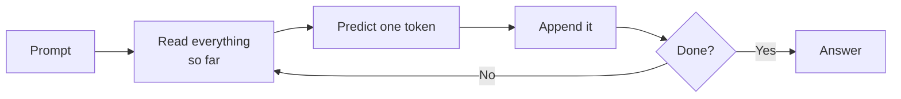

# 1. What a model actually is

## A file full of numbers

Strip away the mystique and a language model is a large mathematical function stored
in a file. The file contains numbers — billions of them — called **parameters**, or
**weights**. They are produced by training: showing the model enormous quantities of
text and nudging every number slightly, over and over, until it becomes good at one
narrow task.

That task is: *given some text, predict what comes next.*

Nothing else is in the file. No database of facts, no index, no network connection.
Everything a model appears to know is encoded in the relationships between those
numbers. This is why models are confidently wrong: they are not recalling, they are
predicting. A plausible continuation and a true one are the same thing to a model.

## What "B" means

**B stands for billion parameters.** A 4B model contains roughly four billion numbers.

This is the single most important figure about any model. It determines both how
capable the model is and how much memory it needs, and those two facts drive every
decision in this book.

| Notation | Parameters | What to expect |
| --- | --- | --- |
| 270M, 0.6B | 270 million, 600 million | Classification, extraction, autocomplete. Not a conversationalist. |
| 3B–4B | 3–4 billion | A real assistant. Holds a conversation, follows instructions, uses tools — but shallow. |
| 7B–14B | 7–14 billion | Noticeably better reasoning. The usual "good local model" band. |
| 30B–70B | 30–70 billion | Strong. Comparable to hosted services on everyday tasks. |
| 200B+ | 200 billion and up | Frontier tier. Serious hardware required. |

Two qualifications matter more than the table.

**Newer beats bigger.** Training methods improve fast. A recent 4B model will
outperform a three-year-old 13B model on most tasks. Parameter count only compares
models of the same generation.

**Count says nothing about purpose.** A 7B model trained for code and a 7B model
trained for conversation are different tools. [Chapter 7](/book/07-reading-model-names)
covers how to tell them apart.

## Tokens

Models do not process characters or words. Text is split into **tokens** — fragments
of roughly three to four characters. Common words are a single token; unusual ones are
several. `unbelievable` might become `un` + `bel` + `iev` + `able`.

Three consequences:

- **Speed is measured in tokens per second.** This is the number you will watch
  throughout the book.
- **Limits and prices are counted in tokens**, never in words.
- **Non-English text costs more.** Most tokenizers are fitted to English. The same
  passage in a language with rich inflection — Polish, Finnish, Turkish — typically
  costs about twice as many tokens. You get less context and slower apparent output
  for the same content.

## The generation loop

Text is produced strictly one token at a time. The model reads everything so far,
predicts one token, appends it, and reads everything again.

A 500-word English answer is roughly 700 trips around that loop. The loop is strictly
sequential — token *n+1* cannot be computed before token *n* exists — which is why
answers stream in rather than appearing at once, and why the hardware analysis in
[Chapter 4](/book/04-the-gpu) turns out the way it does.

## The context window

Everything a model can see at once — your question, the conversation so far, pasted
documents, results returned by tools — is the **context window**, measured in tokens.
Current models range from 8,000 tokens to over a million.

Two common misconceptions are worth correcting immediately.

**It is not memory.** When a conversation outgrows the window, the oldest part is
dropped. It is gone, not archived. A model that "forgets" what you said twenty minutes
ago has not malfunctioned.

**It is not free.** Context consumes memory on top of the model itself, and that
memory grows as the conversation does. A model that loads comfortably with a short
context can fail with a long one. [Chapter 2](/book/02-size-and-memory) quantifies this.

## What this means going forward

Three facts from this chapter carry through the rest of the book:

1. A model is a fixed-size file of numbers that must be loaded into memory to be used.
2. Producing output is a sequential loop, repeated once per token.
3. Context is an additional, variable memory cost on top of the model.

The next chapter turns these into arithmetic.
