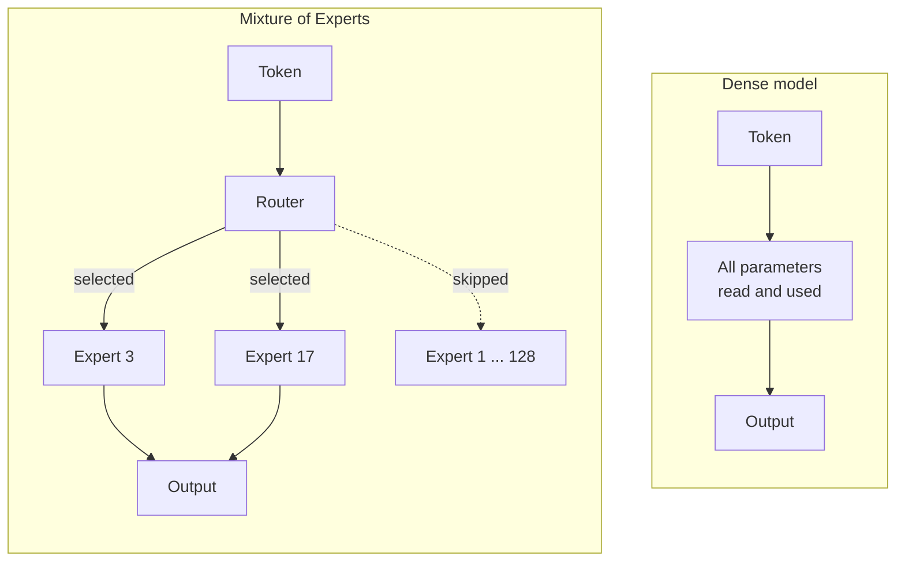

# 3. Dense models and sparse ones

The previous chapter stated that every parameter is read for every token. That is true
of **dense** models, which is what most models are. There is a second architecture
where it is deliberately false, and it changes what hardware you need.

## Mixture of Experts

A **Mixture of Experts** model — MoE, or a *sparse* model — is internally divided into
many specialised sub-networks called experts. For each token, a small router selects a
few of them and ignores the rest.

You will see this written as **30B-A3B**: thirty billion parameters in total, of which
about three billion are *active* per token.

## Why it matters

The consequence is worth stating on its own:

::: tip The sparse-model rule
**Memory requirement scales with total parameters. Speed scales with active
parameters.**
:::

All the weights must be resident in memory, because the router may select any expert
at any moment. But only the selected ones are read for a given token, so the per-token
cost resembles a much smaller model.

A concrete comparison at Q4_K_M:

| Model | Total | Active | Memory needed | Generation speed resembles |
| --- | --- | --- | --- | --- |
| 32B dense | 32B | 32B | ~18 GB | a 32B model |
| 30B-A3B sparse | 30B | ~3B | ~17 GB | a 3B model |

Nearly the same memory. Roughly ten times the speed.

## Correcting the speed formula

[Chapter 2](/book/02-size-and-memory) gave the rule:

$$\text{tokens per second} \approx \frac{\text{bandwidth}}{\text{model size}}$$

For a sparse model, the denominator is not the total size. Nor, quite, is it the active
size. It sits between the two, and it is worth knowing why, because the gap can be large.

- **Attention layers are shared.** They are read for every token regardless of which
  experts the router picks, so they never benefit from sparsity.
- **Different tokens pick different experts.** Over a batch of requests, most of the
  model gets touched even though each individual token touched little of it.
- **Scattered reads are less efficient.** Hardware reaches its rated bandwidth on long
  sequential reads. Jumping between experts does not qualify.

::: tip How to use the formula on a sparse model
Compute it with the **active** parameters to get an optimistic bound, and with the
**total** parameters to get a pessimistic one. Reality lands between them, usually much
closer to the optimistic end.

If the number matters, measure it ([Chapter 6](/book/06-the-first-run)). This is the one
place in the book where the arithmetic will not give you a trustworthy answer.
:::

## What this unlocks

This is the mechanism that makes modest hardware useful beyond its apparent class.

A machine with a small GPU but generous system RAM cannot run a 30B dense model in any
practical sense — every token would drag 18 GB across a slow bus. The same machine can
run a 30B-A3B sparse model at single-digit tokens per second, because each token only
touches a few gigabytes.

Slow, but usable. And a 30B-class model is a qualitatively different thing from a 4B
one: it chains tool calls, holds a plan across steps, and recovers from its own
mistakes.

The trade is real but modest. Sparse models are generally a little weaker than dense
models of the same *total* size, because not all of the model is used on each
token. They are dramatically stronger than dense models of the same *active* size.
That is the whole point of the architecture.

## Why nearly every large model is sparse

Look at any recent model above roughly 100B parameters and it will be a MoE.
DeepSeek-V3 is 671B total with 37B active. The pattern is universal at the top end
because it is the only way to keep serving costs tolerable: a provider pays for
compute per token, and sparse models cut that by an order of magnitude while keeping
the capacity that large parameter counts buy.

For anyone running models themselves the implication reverses. Sparse models are
generous with compute and greedy with memory — and memory is exactly what is scarce
and expensive. A 671B-A37B model needs enough RAM for 671B parameters. The fact that
only 37B are active per token does not reduce that by one byte.

## What this means going forward

- "30B-A3B" means 30B total, 3B active. Both numbers matter, for different reasons.
- Size your **memory** against the total. Size your **speed expectations** against the
  active count.
- Sparse models are the reason a machine with lots of ordinary RAM and a modest GPU is
  not a dead end.

The next chapter looks at where memory actually lives, and how fast it is.
