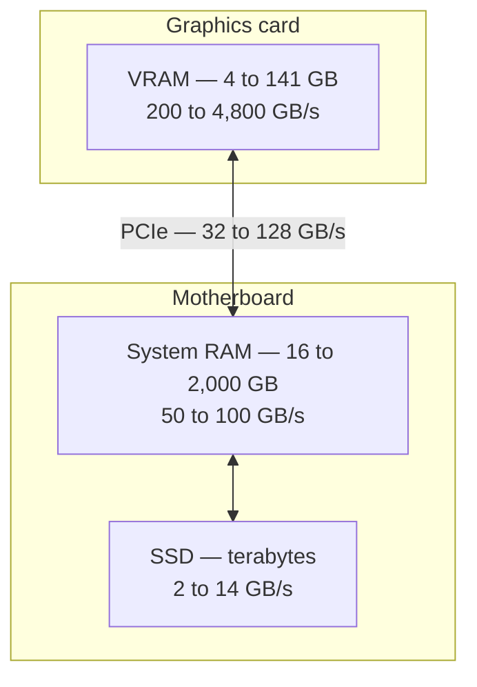

# 4. The graphics card

Generation is mostly about moving bytes. So the question becomes: which piece of
hardware moves bytes fastest, and why is it a graphics card?

## Where memory lives

A computer has a hierarchy of memory, and the difference between its levels is not
subtle.

Two things to read off this diagram.

**VRAM is roughly four to fifty times faster than system RAM.** That ratio, far more
than any difference in arithmetic capability, is why models run on graphics cards.

**The link between them is narrow.** PCIe is slower than either memory it connects. A
model split across VRAM and system RAM pays that toll continuously, which is why a
partial fit performs much closer to the slow side than to the fast one.

## VRAM

**VRAM** is memory soldered onto the graphics card, dedicated to the GPU and physically
separate from system RAM. The two are not interchangeable and they do not add up. A
machine with 4 GB of VRAM and 32 GB of system RAM does not have 36 GB available to a
model.

VRAM capacity is a **hard wall**. A model either fits or it does not. When it does not,
one of two things happens:

- the software refuses to load it, or
- it splits the model between VRAM and system RAM, and the slow side dominates.

This is why a 4 GB card cannot run a 13B model *at all well*, no matter how modern it
is. There is nowhere to put the weights.

## Bandwidth

**Memory bandwidth**, in gigabytes per second, decides how fast tokens emerge. It is
the numerator in the formula from [Chapter 2](/book/02-size-and-memory).

It is the product of how wide the memory bus is and how fast the memory runs:

$$\text{bandwidth} \approx \frac{\text{bus width in bits} \times \text{effective clock}}{8}$$

Bus width is the specification people forget to check. A card advertised with generous
VRAM on a narrow bus will hold a large model and generate slowly — which is often
exactly the wrong trade.

### Memory technologies

| Technology | Typical bandwidth | Found in |
| --- | --- | --- |
| DDR4 / DDR5 | 50–100 GB/s | System RAM |
| LPDDR5X (unified) | 270–820 GB/s | Apple Silicon, NVIDIA GB10 |
| GDDR6 | 200–700 GB/s | Mid-range and mobile GPUs |
| GDDR7 | 1,000–1,800 GB/s | Current high-end GPUs |
| HBM2e / HBM3 / HBM3e | 2,000–4,800 GB/s | Datacenter accelerators |

**HBM** — High Bandwidth Memory — is stacked vertically and sits on the same package as
the processor, giving it an enormously wide bus. It is the main reason datacenter parts
cost what they do, and the main thing you are buying when you pay for them.

## The two phases of a request

Every request has two phases with completely different hardware demands. Almost all
confusing advice about AI hardware comes from conflating them.

| Phase | What happens | Limited by | What you perceive |
| --- | --- | --- | --- |
| **Prefill** | The model reads your input. Every token is processed in parallel, so this is a large matrix multiplication. | **Compute** (FLOPS) | The pause before the first word |
| **Decode** | Tokens are produced one at a time, each requiring a full pass over the weights. | **Memory bandwidth** | The words appearing |

This distinction resolves the contradiction you will otherwise keep hitting: a machine
can be fast at one phase and slow at the other.

**A machine with large capacity and modest compute** — Apple Silicon is the standard
example — generates text at a reasonable rate but takes a long time to digest a long
prompt. Paste in fifty pages and you wait, possibly minutes, before the first word.
This is a prefill problem, and no amount of memory fixes it, because prefill is limited
by arithmetic throughput rather than by memory.

The effect is not marginal. Datacenter accelerators have roughly ten times the matrix
throughput of a high-end consumer-grade unified-memory machine. For a conversational
back-and-forth with short prompts, that gap is invisible. For summarising a long
document, analysing a codebase, or any agent that re-reads a large context on every
step, it is the dominant cost.

::: tip Which phase do you care about?
Short prompts, long answers — chat, drafting — are decode-heavy. Optimise bandwidth.

Long prompts, short answers — summarisation, code analysis, retrieval, agents — are
prefill-heavy. Optimise compute.
:::

## Compute and tensor cores

**Tensor cores** are dedicated matrix-multiplication units. They are what makes prefill
fast, and their generation matters: each of Ampere, Ada, Hopper and Blackwell brought
substantial gains for the numeric formats inference uses.

Compute is quoted in **TFLOPS** — trillions of floating-point operations per second.
Read these numbers with suspicion. Vendors routinely quote figures "with sparsity",
which doubles the headline and does not apply to normal inference, and they quote
low-precision formats such as FP4 which not all software can use. Compare like with
like, and halve any number marked with an asterisk.

**Compute capability** is NVIDIA's version number for a GPU's feature set — 8.6 for
Ampere-generation workstation cards, 9.0 for Hopper, 12.0 for Blackwell. Software
checks it to decide which code paths are available. Most inference tooling requires 5.0
or higher, which means anything from roughly 2014 onward qualifies.

## Unified memory

Apple Silicon and NVIDIA's GB10 use **unified memory**: one pool shared by CPU and GPU
instead of two separate pools with a bus between them.

The advantage is capacity. A workstation built this way can offer hundreds of gigabytes
to the GPU, far beyond what any discrete card provides, and at a fraction of the price
per gigabyte.

The trade-offs are bandwidth well below HBM, and — as described above — much weaker
prefill. For holding very large models at acceptable speed for one user, unified memory
is outstanding value. For serving many users quickly, it is not.

## Reading a spec sheet

When you are handed GPU specifications, read them in this order:

1. **VRAM capacity (GB)** — decides *what you can run at all*. Non-negotiable, check first.
2. **Memory bandwidth (GB/s)** — decides *how fast it generates*. Check the bus width if bandwidth is not quoted directly.
3. **Compute (TFLOPS, tensor core generation)** — decides *prompt processing speed*, and throughput when several people share the card.
4. **Interconnect (NVLink or PCIe)** — only relevant with more than one GPU. See [Chapter 11](/book/11-reference-architectures).
5. **Power draw, cooling, physical size** — decides whether you can actually deploy it.

Clock speeds, CUDA core counts and gaming benchmarks tell you very little about
inference performance. Ignore them.

## What this means going forward

- VRAM capacity is a hard wall; bandwidth sets generation speed; compute sets prompt
  processing speed.
- Prefill and decode are different problems, and hardware can be good at one and bad
  at the other.
- Unified memory trades bandwidth and compute for capacity, which is an excellent trade
  for some workloads and a poor one for others.

The next chapter applies all of this to a specific, ordinary machine.
