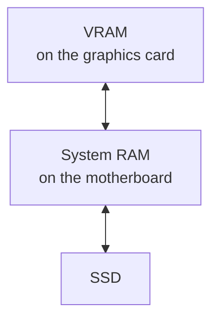

# 4. The graphics card

Generation is mostly about moving bytes. So the question becomes: which piece of
hardware moves bytes fastest, and why is it a graphics card?

## Where memory lives

A computer has a hierarchy of memory, and the difference between its levels is not
subtle.

The three levels differ enormously, and the link between the top two is itself a
bottleneck:

| Level | Capacity | Speed |
| --- | --- | --- |
| VRAM | 4–141 GB | 200–4,800 GB/s |
| PCIe, the link between them | — | 32–128 GB/s |
| System RAM | 16–2,000 GB | 50–100 GB/s |
| SSD | terabytes | 2–14 GB/s |

Two things to read off this.

**VRAM is roughly four to fifty times faster than system RAM.** That ratio, far more
than any difference in arithmetic capability, is why models run on graphics cards.

**The link between them is narrow.** PCIe is slower than either memory it connects. A
model split across VRAM and system RAM pays that toll continuously, which is why a
partial fit performs much closer to the slow side than to the fast one.

## VRAM

**VRAM** — video RAM — is memory soldered onto the graphics card, dedicated to the GPU and
physically separate from system RAM. The two are not interchangeable and they do not add
up: a machine with 8 GB of VRAM and 64 GB of system RAM does not have 72 GB available to
a model.

VRAM capacity is a **hard wall**. A model either fits or it does not. When it does not,
one of two things happens:

- the software refuses to load it, or
- it splits the model between VRAM and system RAM, and the slow side dominates.

This is why a small card cannot run a large model *at all well*, no matter how modern the
card is. There is nowhere to put the weights.

## Bandwidth

**Memory bandwidth**, in gigabytes per second, decides how fast tokens emerge. It is
the numerator in the formula from [Chapter 2](/book/02-size-and-memory).

It is the product of how wide the memory bus is and how fast the memory runs:

$$\text{bandwidth} \approx \frac{\text{bus width in bits} \times \text{effective clock}}{8}$$

Bus width is the specification people forget to check. A card advertised with generous
VRAM on a narrow bus will hold a large model and generate slowly — which is often
exactly the wrong trade.

### Memory technologies

| Technology | Typical bandwidth | Found in |
| --- | --- | --- |
| DDR4 / DDR5 | 50–100 GB/s | System RAM |
| GDDR6 | 200–700 GB/s | Mid-range and laptop GPUs |
| LPDDR5X (unified) | 270–1,200 GB/s | Apple Silicon, NVIDIA GB10 |
| GDDR7 | 1,000–1,800 GB/s | Current high-end GPUs |
| HBM2e / HBM3 / HBM3e | 2,000–4,800 GB/s | Datacenter accelerators |

**HBM** — High Bandwidth Memory — is stacked vertically and sits on the same package as
the processor, giving it an enormously wide bus. It is the main reason datacenter parts
cost what they do, and the main thing you are buying when you pay for them.

## The two phases of a request

Every request has two phases with completely different hardware demands. Almost all
confusing advice about AI hardware comes from conflating them.

| Phase | What happens | Limited by | What you perceive |
| --- | --- | --- | --- |
| **Prefill** | The model reads your input. Every token is processed in parallel, so this is one large matrix multiplication. | **Compute** | The pause before the first word |
| **Decode** | Tokens are produced one at a time, each requiring a full pass over the weights. | **Memory bandwidth** | The words appearing |

This distinction resolves the contradiction you will otherwise keep hitting: a machine
can be fast at one phase and slow at the other.

**A machine with large capacity and modest compute** — Apple Silicon is the standard
example — generates text at a reasonable rate but takes a long time to digest a long
prompt. Paste in fifty pages and you wait, possibly minutes, before the first word.
This is a prefill problem, and no amount of memory fixes it, because prefill is limited
by arithmetic throughput rather than by memory.

The effect is not marginal. Datacenter accelerators have roughly **fifteen to twenty
times** the matrix throughput of a unified-memory workstation
([Chapter 11](/book/11-reference-architectures) puts numbers on it). For a
conversational back-and-forth with short prompts, that gap is invisible. For summarising
a long document, analysing a codebase, or any agent that re-reads a large context on
every step, it is the dominant cost.

::: tip Which phase do you care about?
Short prompts, long answers — chat, drafting — are decode-heavy. Optimise bandwidth.

Long prompts, short answers — summarisation, code analysis, retrieval, agents — are
prefill-heavy. Optimise compute.
:::

## Compute, and the number that measures it

Bandwidth had a clear unit — gigabytes per second. "Compute" needs the same treatment,
because it is the term people wave at without saying what it is.

**Compute is measured in TFLOPS**: trillions of floating-point operations per second. It
is the rate at which the card can multiply numbers together, and it is what sets prefill
speed. Where bandwidth answers "how fast can the card *fetch* the model", compute answers
"how fast can the card *do arithmetic* with it".

The work is done by **tensor cores** — units built specifically for the matrix
multiplications that neural networks consist of. Their generation matters: Ampere, Ada,
Hopper and Blackwell each brought substantial gains.

::: warning Two different numbers, confusingly similar names
**Compute** (TFLOPS) is a *speed*. Bigger is faster. An H200 is around 990 TFLOPS, a
high-end workstation card around 250.

**Compute capability** (8.6, 9.0, 12.0) is a *version number* for the card's feature set.
It says nothing whatsoever about speed — it only tells software which instructions the
card understands. A brand-new slow card has a higher compute capability than an old fast
one.

When sizing hardware you want the first. You only look up the second to check that your
software will run at all; most inference tooling needs 5.0 or higher, which covers
anything from roughly 2014 onward.
:::

Read TFLOPS figures with suspicion. Vendors routinely quote them "with sparsity", which
doubles the headline and does not apply to ordinary inference, and they quote
low-precision formats such as FP4 that not all software can use. Compare like with like,
and halve any number carrying an asterisk.

## Unified memory

Apple Silicon and NVIDIA's GB10 use **unified memory**: one pool shared by CPU and GPU
instead of two separate pools with a bus between them.

The advantage is capacity. A workstation built this way can offer hundreds of gigabytes
to the GPU, far beyond what any discrete card provides, and at a fraction of the price
per gigabyte.

The trade-offs are bandwidth well below HBM, and — as described above — much weaker
prefill. For holding very large models at acceptable speed for one user, unified memory
is outstanding value. For serving many users quickly, it is not.

## Reading a spec sheet

When you are handed GPU specifications, read them in this order:

1. **VRAM capacity (GB)** — decides *what you can run at all*. Non-negotiable, check first.
2. **Memory bandwidth (GB/s)** — decides *how fast it generates*. Check the bus width if bandwidth is not quoted directly.
3. **Compute (TFLOPS, tensor core generation)** — decides *prompt processing speed*, and throughput when several people share the card.
4. **Interconnect (NVLink or PCIe)** — only relevant with more than one GPU. See [Chapter 11](/book/11-reference-architectures).
5. **Power draw, cooling, physical size** — decides whether you can actually deploy it.

Clock speeds, CUDA core counts and gaming benchmarks tell you very little about
inference performance. Ignore them.

## What this means going forward

- VRAM capacity is a hard wall; bandwidth sets generation speed; compute sets prompt
  processing speed.
- Prefill and decode are different problems, and hardware can be good at one and bad
  at the other.
- Unified memory trades bandwidth and compute for capacity, which is an excellent trade
  for some workloads and a poor one for others.

The next chapter applies all of this to a specific, ordinary machine.
