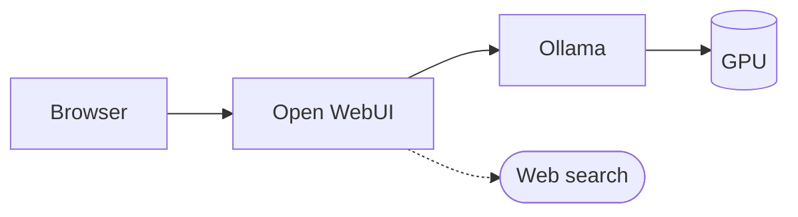

# 6. The first run

Five steps to a working local model with a chat interface and web search. Roughly
fifteen minutes plus download time.

## What you are building



The browser reaches Open WebUI on port 3000; Open WebUI reaches Ollama on port 11434.

Two components. **Ollama** loads models onto the GPU and exposes an HTTP API.
**Open WebUI** is a browser front-end that talks to it. They are separate on purpose:
anything speaking the same API can replace either half.

## Step 0 — The driver

Everything depends on this, and a broken driver fails *silently* by falling back to the
CPU.

```bash
ubuntu-drivers devices              # what the system detects and recommends
sudo ubuntu-drivers install         # installs the matching nvidia-utils-*
sudo reboot
```

After rebooting:

```bash
nvidia-smi --query-gpu=name,memory.total,driver_version --format=csv
```

You need **driver 550 or newer**. Do not hand-pick an `nvidia-utils-*` version — it must
match the kernel module, and `ubuntu-drivers` is what keeps the two aligned.

If this command does not print your card, stop and fix it. Every later step will appear
to work while running twenty times slower than it should.

## Step 1 — Ollama

```bash
curl -fsSL https://ollama.com/install.sh | sh
```

It installs as a systemd service. Configure it:

```bash
sudo systemctl edit ollama.service
```

```ini
[Service]
Environment="OLLAMA_HOST=0.0.0.0:11434"
Environment="OLLAMA_FLASH_ATTENTION=1"
Environment="OLLAMA_KV_CACHE_TYPE=q8_0"
Environment="OLLAMA_CONTEXT_LENGTH=8192"
```

```bash
sudo systemctl daemon-reload && sudo systemctl restart ollama
```

| Setting | Effect |
| --- | --- |
| `OLLAMA_HOST=0.0.0.0` | Allows the Open WebUI container to reach Ollama. See the warning below. |
| `OLLAMA_FLASH_ATTENTION=1` | A more memory-efficient attention implementation. Free improvement. |
| `OLLAMA_KV_CACHE_TYPE=q8_0` | Halves context memory against the `f16` default ([Chapter 2](/book/02-size-and-memory)). |
| `OLLAMA_CONTEXT_LENGTH=8192` | Raises context from the 4,096-token default. |

::: danger The API has no authentication
Binding to `0.0.0.0` publishes the model to every machine on the network. Anyone who
can reach the port can use your hardware and read your prompts.

Restrict it to the Docker bridge:

```bash
sudo ufw allow in on docker0 to any port 11434
sudo ufw deny 11434
```

If you are not using Docker, omit `OLLAMA_HOST` entirely — the default binds to
localhost only.
:::

## Step 2 — A model, and the numbers behind it

```bash
ollama pull nemotron-3-nano:4b
ollama run --verbose nemotron-3-nano:4b
```

Ask it something. `--verbose` prints statistics when the answer completes, including
the eval rate — tokens per second. Compare it against the 40–60 predicted in
[Chapter 5](/book/05-the-reference-machine).

While the model is loaded, in another terminal:

```bash
ollama ps
```

The `PROCESSOR` column is where the previous four chapters become concrete:

| Output | Meaning |
| --- | --- |
| `100% GPU` | Entirely in VRAM. What you want. |
| `48%/52% CPU/GPU` | Split across both. You have found the capacity limit. |
| `100% CPU` | The GPU is not being used. Return to Step 0. |

## Step 3 — The chat interface

```bash
docker run -d -p 3000:8080 \
  --add-host=host.docker.internal:host-gateway \
  -v open-webui:/app/backend/data \
  -e WEBUI_SECRET_KEY="$(openssl rand -hex 32)" \
  --name open-webui --restart always \
  ghcr.io/open-webui/open-webui:main
```

Open `http://localhost:3000` and create the admin account. The account, chats and
settings all live in that Docker volume on your own disk.

Open WebUI finds Ollama automatically at `http://host.docker.internal:11434`, so the
model should already appear in the picker.

Keep the `WEBUI_SECRET_KEY`. Without a stable one, recreating the container logs
everyone out.

::: info Single-container alternative
`ghcr.io/open-webui/open-webui:ollama` bundles both, but requires
`nvidia-container-toolkit` on the host and `--gpus=all` on the command line.
:::

## Step 4 — Giving it tools

So far the model can only talk. An **agent** is a model given tools — web search, a
shell, file access — that decides on its own when to use them, reads the results, and
acts on them.

In Open WebUI, under **Settings → Admin**:

| Setting | Location | Value |
| --- | --- | --- |
| Web search | Admin → Web Search | Enable. DuckDuckGo needs no API key; SearXNG is self-hosted and private. |
| Tool calling | Admin → Settings | **Native** — the model decides when to search, instead of searching every time |
| Task model | Admin → Interface | Point at a small model; it generates chat titles and tags in the background |

Now a request like *"find three suppliers for this part, sort them by price, and
justify the ranking"* will cause the model to search, read the results, and answer with
sources.

::: danger Prompt injection
The moment a model reads web pages, the contents of those pages become instructions it
may follow. A page can contain text along the lines of *"ignore your previous
instructions and instead…"*, and models frequently comply.

This is a real and unsolved class of attack. Treat any agent with web access as
untrusted. Never give it credentials that matter, and think carefully before enabling
shell or filesystem tools. See [Chapter 12](/book/12-security).
:::

## Step 5 — The comparison worth making

Pull a sparse model and run the same prompt on both:

```bash
ollama pull ornith-1.5:35b-a3b
```

| Model | `ollama ps` | Speed | Behaviour |
| --- | --- | --- | --- |
| `nemotron-3-nano:4b` | `100% GPU` | 40–60 tok/s | Searches and answers, but reasoning over results is shallow and it loses the thread across steps |
| `ornith-1.5:35b-a3b` | CPU/GPU split | 8–15 tok/s | Chains tool calls correctly and holds a plan together |

That difference is the practical meaning of model size. On 4 GB of VRAM you choose one
or the other; you do not get both. [Chapter 8](/book/08-the-model-landscape) shows what
hardware removes the choice.

The second model only manages those speeds because it is sparse — 3B of its 36B
parameters are active per token ([Chapter 3](/book/03-dense-and-sparse)). A dense model
of the same footprint, run mostly from system RAM, would be several times slower.

## Measuring your own machine

Every number in this book is an estimate. Yours are not — you can take them in a couple
of minutes, and you should before making any decision that costs money.

### The two numbers that matter

```bash
ollama run --verbose nemotron-3-nano:4b
```

Ask something, and read the summary printed after the answer:

| Line | What it is | Chapter |
| --- | --- | --- |
| `prompt eval rate` | How fast it read your input — **prefill** | [4](/book/04-the-gpu) |
| `eval rate` | How fast it wrote the answer — **decode** | [2](/book/02-size-and-memory) |

Compare `eval rate` against bandwidth ÷ model size. If you are getting far less than half
of that, something is wrong — most often the model is not fully on the GPU. Check with
`ollama ps`.

### Measuring prefill properly

A short question tells you nothing about prompt processing, because there is barely any
prompt. Feed it something large instead:

```bash
# roughly 30,000 tokens of input
cat some-long-document.txt | ollama run --verbose nemotron-3-nano:4b "Summarise this."
```

Now `prompt eval rate` is meaningful, and the gap between the two rates is the
prefill-versus-decode split from [Chapter 4](/book/04-the-gpu) made concrete.

### Testing a sparse model

This matters most for sparse models, where [Chapter 3](/book/03-dense-and-sparse) says
the arithmetic gives only a range. Run the same measurement on `ornith-1.5:35b-a3b` and
see where inside that range your hardware actually lands.

### Going further

| Tool | For |
| --- | --- |
| `llama-bench` | Systematic sweeps across models, quantizations and context lengths |
| `vllm bench` | Throughput and latency under concurrent load — the numbers that matter in [Chapter 10](/book/10-from-one-user-to-many) |

### What to write down

Keep a short record: model, quantization, context length, prefill rate, decode rate, and
what `ollama ps` reported. Four lines per model. It takes minutes and it is the only
defence against arguing from memory six months later.

## When something breaks

| Symptom | Cause and fix |
| --- | --- |
| GPU disappears after suspend/resume | Known driver bug on laptops. `sudo rmmod nvidia_uvm && sudo modprobe nvidia_uvm`. Ollama silently falls back to CPU when this happens. |
| `ollama ps` shows `100% CPU` | Model too large for VRAM, or a broken driver. Check `nvidia-smi` first. |
| Open WebUI lists no models | Ollama is not listening on `0.0.0.0`. Recheck the systemd override. |
| Out of memory after raising context | Lower `OLLAMA_CONTEXT_LENGTH`, or confirm `OLLAMA_KV_CACHE_TYPE=q8_0` took effect. |
| Model reloads on every message | Raise `OLLAMA_KEEP_ALIVE`. The default unloads after five minutes. |

Useful commands:

```bash
ollama ps                              # what is loaded, and where
ollama list                            # what is downloaded
ollama stop <model>                    # unload immediately
journalctl -u ollama -f                # server logs
curl http://localhost:11434/api/tags   # API reachable?
```
