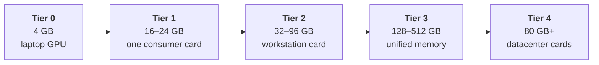
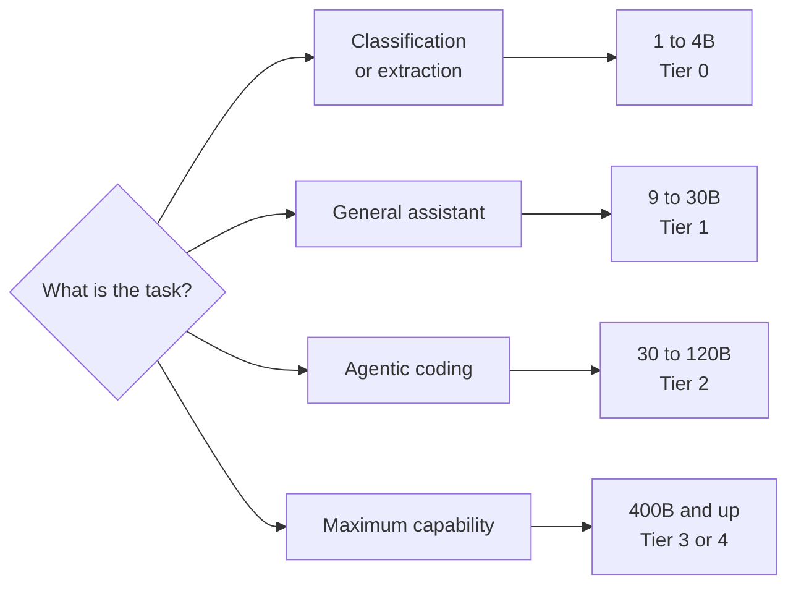

# 8. Every model, and what it costs to run

Most writing about local models starts from a particular machine and asks what fits.
This chapter does the opposite: it lays out the whole range, from models that run on a
phone to models that need a rack, and states the hardware each one requires.

Nothing here is out of reach in principle. Everything is a question of how much memory
you are willing to buy.

## The sizing method

Everything below is measured in **the memory the GPU can reach**: VRAM on a graphics
card, or the shared pool on a unified-memory machine ([Chapter 4](/book/04-the-gpu)).
System RAM does not count. A model that does not fit in that pool either refuses to load
or spills into system RAM and slows to a crawl.

From [Chapter 2](/book/02-size-and-memory), at Q4_K_M each billion parameters costs about
0.55 GB. On top of the weights you need room for the KV cache and the runtime, which is
where the third column below comes from:

$$\text{GPU memory needed} \approx \underbrace{\text{total parameters (B)} \times 0.55}_{\text{weights}} + \underbrace{\text{KV cache}}_{\text{depends on context}} + \underbrace{\sim 1\ \text{GB}}_{\text{runtime}}$$

For sparse models, **use the total parameter count, not the active one**
([Chapter 3](/book/03-dense-and-sparse)). Every expert must be resident even though only
a few are used per token.

| Total parameters | Weights at Q4 | With a 32K context | With a 128K context |
| --- | --- | --- | --- |
| 1B | 0.6 GB | 2 GB | 4 GB |
| 4B | 2.2 GB | 4 GB | 8 GB |
| 8B | 4.4 GB | 7 GB | 13 GB |
| 14B | 7.7 GB | 12 GB | 20 GB |
| 24B | 13 GB | 18 GB | 30 GB |
| 32B | 18 GB | 23 GB | 35 GB |
| 70B | 39 GB | 45 GB | 61 GB |
| 120B | 66 GB | 74 GB | 92 GB |
| 235B | 129 GB | 140 GB | 165 GB |
| 400B | 220 GB | 235 GB | 270 GB |
| 671B | 369 GB | 390 GB | 430 GB |
| 1T | 550 GB | 580 GB | 630 GB |

At Q8 the weights double. At FP16 they quadruple. The cache figures assume 8-bit storage;
at 16-bit, double them.

The gap between the last two columns is the price of a long context, and it is the
number most people forget to budget for.

## What you are paying for

The table below quotes several kinds of memory — GDDR6, GDDR7, HBM3, unified. They are
described in [Chapter 4](/book/04-the-gpu#memory-technologies); here is what they mean for
the purchase.

**Bandwidth is the bulk of a datacenter card's price.** An H100 moves bytes about twice
as fast as a high-end workstation card and does roughly four times the arithmetic. The
first of those sets generation speed, the second sets prompt-reading speed
([Chapter 4](/book/04-the-gpu)). You pay several times more for both together.

**The `e` in HBM3e means "enhanced"** — the same technology clocked higher. It is
essentially the whole difference between an H100 and an H200.

**Unified memory trades speed for capacity.** One shared pool lets the GPU address far
more memory than any card carries, but it is ordinary laptop-class memory, several times
slower than HBM, with a compute penalty that
[Chapter 11](/book/11-reference-architectures) quantifies.

**Capacity and bandwidth are separate purchases.** A machine with 512 GB of unified
memory holds a model an H100 cannot touch, and runs it more slowly than the H100 would.
Neither number alone tells you what you need to know.

## The hardware tiers

| Tier | Hardware | GPU memory | Type | Bandwidth | Largest model at Q4, 32K context |
| --- | --- | --- | --- | --- | --- |
| **0** | Laptop workstation GPU | 4 GB | GDDR6 | ~190 GB/s | 4B dense |
| **1** | RTX 4090 | 24 GB | GDDR6X | ~1,010 GB/s | 32B dense |
| **2a** | RTX 5090 | 32 GB | GDDR7 | ~1,790 GB/s | 32B dense, comfortably |
| **2b** | RTX PRO 6000 Blackwell | 96 GB | GDDR7 | ~1,790 GB/s | 120B sparse |
| **3a** | DGX Spark (GB10) | 128 GB | Unified | ~273 GB/s | 200B sparse |
| **3b** | Mac Studio, M-series Ultra | up to 512 GB | Unified | ~820 GB/s | **671B sparse** |
| **4a** | 1× H100 SXM | 80 GB | HBM3 | ~3,350 GB/s | 120B sparse |
| **4b** | 4× RTX PRO 6000 | 384 GB | GDDR7 | ~1,790 GB/s each | 400B sparse |
| **4c** | 8× H200 | 1,128 GB | HBM3e | ~4,800 GB/s each | 1T sparse |

Figures are approximate and vary between **SKUs** — a SKU, or stock-keeping unit, is a
vendor's code for one exact product variant. The same card name often covers several,
with different memory sizes and clocks. Prices and parts move; treat the ratios as the
durable part.

Two things the table does not say.

**Multi-card rows are not one pool.** "4× 96 GB = 384 GB" only holds a 400B model if the
model is split across all four cards, which needs tensor parallelism and a fast link
between them ([Chapter 11](/book/11-reference-architectures)). Without NVLink this works
but costs speed. Running four separate models on four cards has no such problem.

**Tier 0 has a second mode.** The table counts only memory the GPU can reach. A machine
with a small card but generous system RAM can also run much larger *sparse* models from
system memory at single-digit tokens per second
([Chapter 5](/book/05-the-reference-machine)). Slow, but it is the difference between a
4B model and a 30B one.

::: tip The answer to the obvious question
**Yes, you can run the largest open models on your own hardware.** DeepSeek-V3 at 671B
parameters fits in a single Mac Studio with 512 GB of unified memory, at Q4, for around
€10,000 — roughly the price of one H100.

It will generate at a usable rate and read long prompts slowly, for exactly the reasons
in [Chapter 4](/book/04-the-gpu). "Not achievable locally" is almost never true. "Not
achievable at this price, at this speed" usually is.
:::

## The model range

::: info The same family appears more than once
A family is a recipe, not a size. `qwen3.5` ships in everything from 0.8B to 122B;
`gpt-oss` comes as 20B and 120B; `granite4.2` as 3B, 8B and 30B. Seeing the same name in
two tiers below is not a mistake — it is the same training approach at a different scale,
and the sizes behave very differently.

Always pin the size when you pull a model. `gpt-oss:20b` and `gpt-oss:120b` are a six-fold
difference in hardware.
:::

**On context.** Most models released since 2024 advertise a 128K-token window; a few
reach 256K or beyond. Two cautions. The advertised figure is an upper limit, not a
promise of quality — many models degrade well before it. And the window you *configure*
is what costs memory, so the tables above are worth rereading before you set it. Check
the model card for the real number.

### Small — Tier 0 and up

| Model | Size | Notes |
| --- | --- | --- |
| `granite4.2` | 3B | Apache 2.0. Reliable tool calling and JSON output. |
| `qwen3.5` | 0.8B, 2B, 4B | Strong all-rounder, tool calling, thinking mode. |
| `gemma4` | e2B, e4B | Efficient variants built for laptops. Good multilingual. |
| `nemotron-3-nano` | 4B | Tuned for agentic use. |
| `llama3.2` | 1B, 3B | Older; small and predictable. |

Useful for: classification, extraction, summarisation, simple agents, autocomplete.
Not useful for: multi-step reasoning, agentic coding.

### Mid-range — Tier 1

| Model | Size | Notes |
| --- | --- | --- |
| `qwen3.5:9b`, `qwen3.5:27b` | 9B, 27B dense | The size most people find "good enough" |
| `gemma4:12b`, `gemma4:26b` | 12B, 26B dense | Vision, tools, thinking |
| `granite4.2:8b` | 8B dense | Enterprise workloads, retrieval |
| `mistral-small3.2` | 24B dense | Vision and tools |
| `gpt-oss:20b` | 20B sparse | Reasoning and agents |
| `qwen3-coder:30b` | 30B sparse | Code |
| `devstral-small-2` | 24B dense | Agentic coding |

This tier is the sweet spot for one developer. A single 24 GB card runs everything here
at 20–50 tokens per second with a 32K context.

### Large — Tier 2 and 3

| Model | Total / active | Q4 weights | Notes |
| --- | --- | --- | --- |
| `llama3.3:70b` | 70B dense | ~39 GB | Long-standing reference point |
| `qwen3-next:80b` | 80B-A3B | ~44 GB | Very fast for its capability |
| `gpt-oss:120b` | 120B sparse | ~66 GB | Fits one 96 GB card, or one H100 |
| `nemotron-3-super` | 120B-A12B | ~66 GB | Multi-agent workloads |
| `qwen3.5:122b` | 122B sparse | ~67 GB | |
| `mistral-medium-3.5` | 128B | ~70 GB | Vision, tools, thinking |

This is where open models start being straightforwardly competitive with hosted
services for most work.

### Frontier open weights — Tier 3b and 4

| Model | Total / active | Q4 weights | Minimum practical hardware |
| --- | --- | --- | --- |
| `llama4` | 400B-A17B | ~220 GB | Mac Studio 512 GB, or 3× 96 GB cards |
| `deepseek-v3` | 671B-A37B | ~369 GB | Mac Studio 512 GB, or 4× 96 GB cards |
| `kimi-k2` and successors | ~1T-A32B | ~550 GB | 8× H200, or a very large unified-memory machine |
| `glm-5.x` | not disclosed | — | Rack-scale |

DeepSeek-V3's own documentation recommends SGLang, vLLM or TensorRT-LLM across
multiple nodes, and ships FP8 weights natively. That is the shape of a serious
deployment: not one card, but a coordinated group of them
([Chapter 11](/book/11-reference-architectures)).

## How these compare to hosted frontier models

This is the comparison everyone wants, and it requires care, because half the data does
not exist.

### What is not public

**The parameter counts of closed frontier models are not disclosed.** OpenAI, Anthropic
and Google have published nothing authoritative about the size of their current models.

The one widely-circulated figure is that GPT-4 was approximately 1.8 trillion
parameters in a mixture-of-experts configuration with roughly 280B active. This comes
from industry reporting and claimed leaks, **was never confirmed by OpenAI**, and
concerns a model that is now several generations old. For everything more recent —
GPT-5 and its successors, the Claude and Gemini families — there is no credible public
number at all.

::: warning
Treat any specific parameter count for a closed model as rumour. This book will not
repeat numbers it cannot source.
:::

### What can be compared

Benchmarks, because both open and closed models are evaluated on them.

The broad picture as of this writing: **the largest open-weight models score close to
frontier closed models on most standard benchmarks.** DeepSeek-V3's published results
put it ahead of GPT-4o and Claude 3.5 Sonnet on a majority of coding and mathematics
benchmarks, and its evaluation table is reproducible because the weights are public.

The gap that remains is not primarily in benchmark scores. It is in:

| Dimension | Where closed models still lead |
| --- | --- |
| **Long-horizon agentic reliability** | Sustaining a task over dozens of tool calls without drifting or giving up |
| **Tool-use robustness** | Correct calls, sensible recovery when a call fails |
| **Post-training polish** | Refusal behaviour, formatting, instruction adherence at the margins |
| **The surrounding product** | Retrieval, code execution, memory, orchestration — none of which is the model |

That last row deserves emphasis. A large part of what makes a hosted assistant feel
capable is infrastructure built around the model, not the weights. When you run weights
yourself you get the model and none of the scaffolding; the difference in experience is
larger than the difference in benchmark scores suggests.

### Benchmarks lie, in a specific way

Public benchmarks leak into training data, and vendors optimise for them. A model can
score well and still disappoint on your work.

Use them for one thing only: a rough shortlist of what is worth testing. What decides
anything is running the candidates on tasks you actually do, and comparing the answers
yourself.

## Choosing

Two rules that survive every change in the model landscape:

**Start one tier below what you think you need.** Small models are startlingly capable
at well-specified tasks, and the cost difference between tiers is an order of
magnitude.

**Prefer a newer small model to an older large one.** The generation gap usually
exceeds the size gap.
