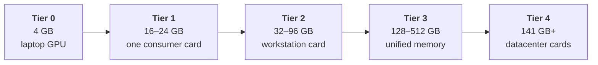
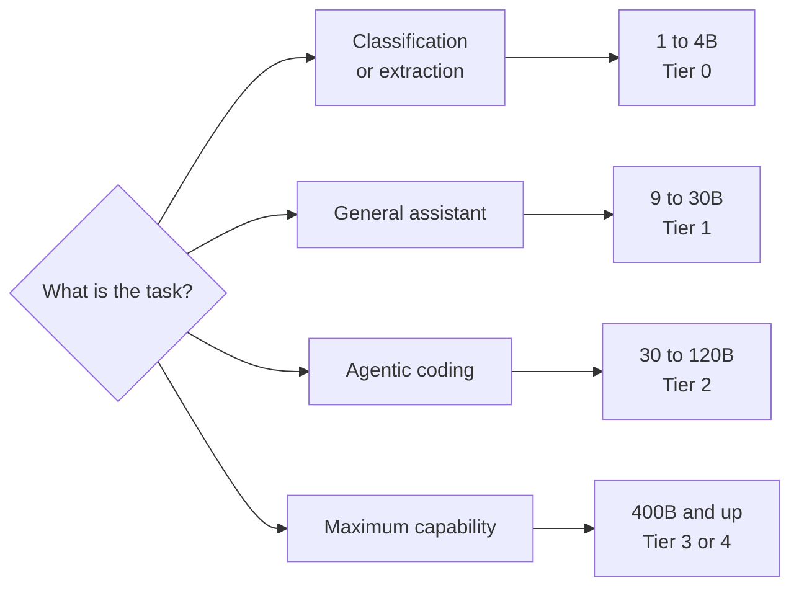

# 8. Every model, and what it costs to run

Most writing about local models starts from a particular machine and asks what fits.
This chapter does the opposite: it lays out the whole range, from models that run on a
phone to models that need a rack, and states the hardware each one requires.

Nothing here is out of reach in principle. Everything is a question of how much memory
you are willing to buy.

## The sizing method

Everything below is measured in **the memory the GPU can reach**: VRAM on a graphics
card, or the shared pool on a unified-memory machine ([Chapter 4](/book/04-the-gpu)).
System RAM does not count. A model that does not fit in that pool either refuses to load
or spills into system RAM and slows to a crawl.

From [Chapter 2](/book/02-size-and-memory), at Q4_K_M each billion parameters costs about
0.55 GB. On top of the weights you need room for the KV cache and the runtime:

$$\text{GPU memory needed} \approx \underbrace{\text{total parameters (B)} \times 0.55}_{\text{weights}} + \underbrace{\text{KV cache}}_{\text{depends on context}} + \underbrace{\sim 1\ \text{GB}}_{\text{runtime}}$$

For sparse models, **use the total parameter count, not the active one**
([Chapter 3](/book/03-dense-and-sparse)). Every expert must be resident even though only
a few are used per token.

| Total parameters | Weights at Q4 | A current model this size |
| --- | --- | --- |
| 1B | 0.6 GB | |
| 4B | 2.2 GB | Spark-X2.5-4B |
| 9B | 5 GB | K2-Horizon-7B |
| 14B | 7.7 GB | |
| 27B | 15 GB | **Qwen3.8-27B** |
| 36B | 20 GB | Ornith-1.5-35B-A3B |
| 49B | 27 GB | Kimi-Linear-48B-A3B |
| 70B | 39 GB | |
| 124B | 68 GB | Nemotron-3-Super-120B-A12B |
| 321B | 177 GB | GLM-5.3-Flash |
| 400B | 220 GB | |
| 753B | 414 GB | GLM-5.3 |
| 763B | 420 GB | DeepSeek-V4.1-Flash |
| 1T | 550 GB | Kimi-K2 |
| 1.6T | 880 GB | DeepSeek-V4-Pro |

At Q8 the weights double. At FP16 they quadruple.

### What the context adds on top

Context windows have moved. Among the most-downloaded text models on Hugging Face today,
**256K is the most common figure and 1M is the frontier**; 128K has become the small
option, and 32K now marks a model as either old or deliberately tiny.

What a window costs depends entirely on the attention architecture, and the spread is no
longer a detail:

| Attention style | Per token | At 256K | At 1M |
| --- | --- | --- | --- |
| Classical, 70B-class | ~160 KB | 42 GB | 164 GB |
| Classical, 120B-class | ~220 KB | 58 GB | 220 GB |
| Compressed, DeepSeek-V4.1-Flash | 890 B | **0.23 GB** | **0.93 GB** |

The bottom row is not a rounding error. A 763B model designed for long context carries a
million tokens in under a gigabyte, while a conventional 70B model needs **four times its
own weight** in memory for the same window.

::: tip Budget the weights, then check the attention
With compressed attention, context is nearly free and the weights are the whole
question. With conventional attention, the window you configure can cost more than the
model itself.

The two cases differ by a factor of roughly two hundred, so there is no safe single
assumption — and assuming the worst case now overstates the requirement for most new
models. [Chapter 2](/book/02-size-and-memory) shows how to read the real figure off a
model card.
:::

## What you are paying for

The table below quotes several kinds of memory — GDDR6, GDDR7, HBM3, unified. They are
described in [Chapter 4](/book/04-the-gpu#memory-technologies); here is what they mean for
the purchase.

**Bandwidth is the bulk of a datacenter card's price.** An H200 moves bytes about two
and a half times as fast as a high-end workstation card and does roughly four times the
arithmetic. The first of those sets generation speed, the second sets prompt-reading
speed ([Chapter 4](/book/04-the-gpu)). You pay several times more for both together.

**The `e` in HBM3e means "enhanced"** — the same technology clocked higher. It is
essentially the whole difference between an H100 and an H200.

**Unified memory trades speed for capacity.** One shared pool lets the GPU address far
more memory than any card carries, but it is ordinary laptop-class memory, several times
slower than HBM, with a compute penalty that
[Chapter 11](/book/11-reference-architectures) quantifies.

**Capacity and bandwidth are separate purchases.** A machine with 512 GB of unified
memory holds a model an H200 cannot touch, and runs it more slowly than the H200 would.
Neither number alone tells you what you need to know.

## The hardware tiers

| Tier | Hardware | GPU memory | Type | Bandwidth | Largest model at Q4 |
| --- | --- | --- | --- | --- | --- |
| **0** | Laptop workstation GPU | 4 GB | GDDR6 | ~190 GB/s | 4B dense |
| **1** | RTX 4090 | 24 GB | GDDR6X | ~1,010 GB/s | 32B dense |
| **2a** | Radeon AI PRO R9700 | 32 GB | GDDR6 | ~640 GB/s | 32B dense, slowly |
| **2b** | RTX 5090 | 32 GB | GDDR7 | ~1,790 GB/s | 32B dense, comfortably |
| **2c** | RTX PRO 6000 Blackwell | 96 GB | GDDR7 | ~1,790 GB/s | 120B sparse |
| **3a** | DGX Spark (GB10) | 128 GB | Unified | ~273 GB/s | 200B sparse |
| **3b** | Mac Studio, M5 Ultra | up to 512 GB | Unified | ~1,200 GB/s | **671B sparse** |
| **4a** | 1× H200 NVL | 141 GB | HBM3 | ~4,800 GB/s | 235B sparse |
| **4b** | 4× RTX PRO 6000 | 384 GB | GDDR7 | ~1,790 GB/s each | 400B sparse |
| **4c** | 8× H200 NVL | 1,128 GB | HBM3 | ~4,800 GB/s each | 1.6T sparse |

Figures are approximate and vary between **SKUs** — a SKU, or stock-keeping unit, is a
vendor's code for one exact product variant. The same card name often covers several,
with different memory sizes and clocks. Prices and parts move; treat the ratios as the
durable part.

Two things the table does not say.

**Multi-card rows are not one pool.** "4× 96 GB = 384 GB" only holds a 400B model if the
model is split across all four cards, which needs tensor parallelism and a fast link
between them ([Chapter 11](/book/11-reference-architectures)). Without NVLink this works
but costs speed. Running four separate models on four cards has no such problem.

**Tier 0 has a second mode.** The table counts only memory the GPU can reach. A machine
with a small card but generous system RAM can also run much larger *sparse* models from
system memory at single-digit tokens per second
([Chapter 5](/book/05-the-reference-machine)). Slow, but it is the difference between a
4B model and a 30B one.

::: tip The answer to the obvious question
**Yes, you can run the largest open models on your own hardware.** A Mac Studio with
512 GB of unified memory holds a 671B model at Q4. Four DGX Spark units joined by a
400 Gb/s cable — roughly €20,000 in total — are rated by NVIDIA for models up to 700
billion parameters ([Chapter 11](/book/11-reference-architectures)).

Either will generate at a usable rate and read long prompts slowly, for exactly the
reasons in [Chapter 4](/book/04-the-gpu). "Not achievable locally" is almost never true.
"Not achievable at this price, at this speed" usually is.

Price the exact configuration before planning around it. Apple charges steeply for
memory, and 512 GB is the top of the range rather than the middle of it.
:::

## The model range

::: info The same family appears more than once
A family is a recipe, not a size. `gemma4` ships as E2B, E4B and 12B; `granite4` as 3B
and 8B; `glm-5.3` as a 321B Flash and a 753B full model. Seeing the same name in two
tiers below is not a mistake — it is the same training approach at a different scale, and
the sizes behave very differently.

Always pin the size when you pull a model. `glm-5.3-flash` and `glm-5.3` are a two-fold
difference in hardware.
:::

**On context.** Most models released since 2024 advertise a 128K-token window; current
ones reach 256K, and the largest now advertise a million. Two cautions. The advertised
figure is an upper limit, not a promise of quality — many models degrade well before it.
And the window you *configure* is what costs memory, so the tables above are worth
rereading before you set it. Check the model card for the real number.

### Small — Tier 0 and up

| Model | Size | Notes |
| --- | --- | --- |
| `nemotron-3-nano` | 4B | Tuned for agentic use. The default choice at this size. |
| `gemma4` | E2B, E4B | Efficient variants built for laptops. Good multilingual. |
| `granite4.1` | 3B | Apache 2.0. Reliable tool calling and JSON output. |
| `minicpm5` | 3B | 128K context in a 2 GB footprint |
| `spark-x2.5` | 4B | A **one-million-token** context at 4B |

Useful for: classification, extraction, summarisation, simple agents, autocomplete.
Not useful for: multi-step reasoning, agentic coding.

### Mid-range — Tier 1

| Model | Size | Notes |
| --- | --- | --- |
| `qwen3.8:27b` | 27B dense | 256K context, vision, tools, thinking. ~15 GB at Q4. |
| `ornith-1.5:35b-a3b` | 36B-A3B | Sparse, so it runs like a 3B model. 256K context. |
| `k2-horizon:7b` | 9B dense | 512K context in 5 GB |
| `gemma4:12b`, `gemma4:26b` | 12B, 26B dense | Vision, tools, thinking |
| `granite4.2:8b` | 8B dense | Enterprise workloads, retrieval |
| `mistral-small3.2` | 24B dense | Vision and tools |
| `qwen3-coder:30b` | 30B sparse | Code |
| `devstral-small-2` | 24B dense | Agentic coding |

This tier is the sweet spot for one developer. A single 24 GB card runs everything here
at 20–50 tokens per second.

The first row is where to start today. A 27B model that takes a 256K context, reads
images, and calls tools, in 15 GB of memory, would have been a datacenter proposition
two years ago. It fits on a single consumer card.

### Large — Tier 2 and 3

| Model | Total / active | Q4 weights | Notes |
| --- | --- | --- | --- |
| `kimi-linear:48b-a3b` | 48B-A3B | ~27 GB | Linear attention. Cheap on long context. |
| `minimax-m2.5` | 116B sparse | ~64 GB | Fits one 96 GB card |
| `mistral-small-4:119b` | 119B | ~65 GB | |
| `nemotron-3-super` | 124B-A12B | ~68 GB | Fits one 96 GB card. Multi-agent workloads. |
| `mistral-medium-3.5` | 128B | ~70 GB | Vision, tools, thinking |
| `glm-5.3-flash` | 321B sparse | ~177 GB | 1M context. Two 96 GB cards, or one unified machine. |

This is where open models start being straightforwardly competitive with hosted
services for most work.

### Frontier open weights — Tier 3b and 4

| Model | Total / active | Q4 weights | Minimum practical hardware |
| --- | --- | --- | --- |
| `llama4` | 400B-A17B | ~220 GB | Mac Studio 512 GB, or 3× 96 GB cards |
| `deepseek-v3` | 671B-A37B | ~369 GB | Mac Studio 512 GB, or 4× 96 GB cards |
| `deepseek-v4.1-flash` | 763B, 8B/16B active | ~420 GB | 5× 96 GB cards, or a 512 GB unified machine |
| `kimi-k2` and successors | ~1T-A32B | ~550 GB | 8× H200, or a very large unified-memory machine |
| `deepseek-v4-pro` | 1.6T-A49B | ~880 GB | 8× H200 NVL |
| `qwen3.8` | 2.4T-A95B | ~1.3 TB | Rack-scale |

**Start with V4.1-Flash rather than with the largest entry on the list.** DeepSeek's own
published evaluation has it matching or beating V4-Pro — a model three times its backbone
size — across general knowledge, coding and mathematics:

| Benchmark | V4-Pro (1.6T, 49B active) | V4.1-Flash (552B, 8B active) |
| --- | --- | --- |
| MMLU-Pro | 73.5 | **74.1** |
| HumanEval | 76.8 | **79.4** |
| GSM8K | 92.6 | **93.0** |
| BigCodeBench | 59.2 | **60.6** |

V4-Pro keeps an edge on factual recall and competition mathematics. It also needs twice
the memory and activates six times as many parameters per token, which is why the API
traffic moved to the smaller model.

This is the clearest illustration in the book of a rule worth internalising: **newer and
smaller beats older and larger, reliably and repeatedly.** Sizing a purchase against
today's largest model is how people end up with hardware that was obsolete before it
arrived.

V4.1-Flash is natively multimodal, takes a **one-million-token context**, ships at FP8,
and is MIT-licensed. Its binding constraint is the 420 GB of weights rather than the
context — as [Chapter 2](/book/02-size-and-memory) shows, a million tokens of cache costs
it under a gigabyte. DeepSeek's documentation points at SGLang, vLLM or TensorRT-LLM
across multiple nodes, which is the shape of a serious deployment: not one card, but a
coordinated group of them ([Chapter 11](/book/11-reference-architectures)).

## How these compare to hosted frontier models

This is the comparison everyone wants, and it requires care, because half the data does
not exist.

### What is not public

**The parameter counts of closed frontier models are not disclosed.** OpenAI, Anthropic
and Google have published nothing authoritative about the size of their current models.

The one widely-circulated figure is that GPT-4 was approximately 1.8 trillion
parameters in a mixture-of-experts configuration with roughly 280B active. This comes
from industry reporting and claimed leaks, **was never confirmed by OpenAI**, and
concerns a model that is now several generations old. For everything more recent —
GPT-5 and its successors, the Claude and Gemini families — there is no credible public
number at all.

::: warning
Treat any specific parameter count for a closed model as rumour. This book will not
repeat numbers it cannot source.
:::

### What can be compared

Benchmarks, because both open and closed models are evaluated on them.

The broad picture as of this writing: **the largest open-weight models score close to
frontier closed models on most standard benchmarks.** Open models publish their
evaluation tables, and because the weights are public those tables can be reproduced —
which is more than can be said for the closed models they are compared against.

The gap that remains is not primarily in benchmark scores. It is in:

| Dimension | Where closed models still lead |
| --- | --- |
| **Long-horizon agentic reliability** | Sustaining a task over dozens of tool calls without drifting or giving up |
| **Tool-use robustness** | Correct calls, sensible recovery when a call fails |
| **Post-training polish** | Refusal behaviour, formatting, instruction adherence at the margins |
| **The surrounding product** | Retrieval, code execution, memory, orchestration — none of which is the model |

That last row deserves emphasis. A large part of what makes a hosted assistant feel
capable is infrastructure built around the model, not the weights. When you run weights
yourself you get the model and none of the scaffolding; the difference in experience is
larger than the difference in benchmark scores suggests.

### Benchmarks lie, in a specific way

Public benchmarks leak into training data, and vendors optimise for them. A model can
score well and still disappoint on your work.

Use them for one thing only: a rough shortlist of what is worth testing. What decides
anything is running the candidates on tasks you actually do, and comparing the answers
yourself.

## Choosing

Two rules that survive every change in the model landscape:

**Start one tier below what you think you need.** Small models are startlingly capable
at well-specified tasks, and the cost difference between tiers is an order of
magnitude.

**Prefer a newer small model to an older large one.** The generation gap usually
exceeds the size gap.
