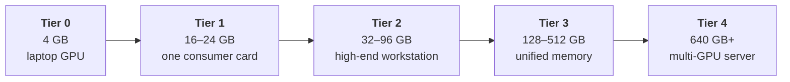
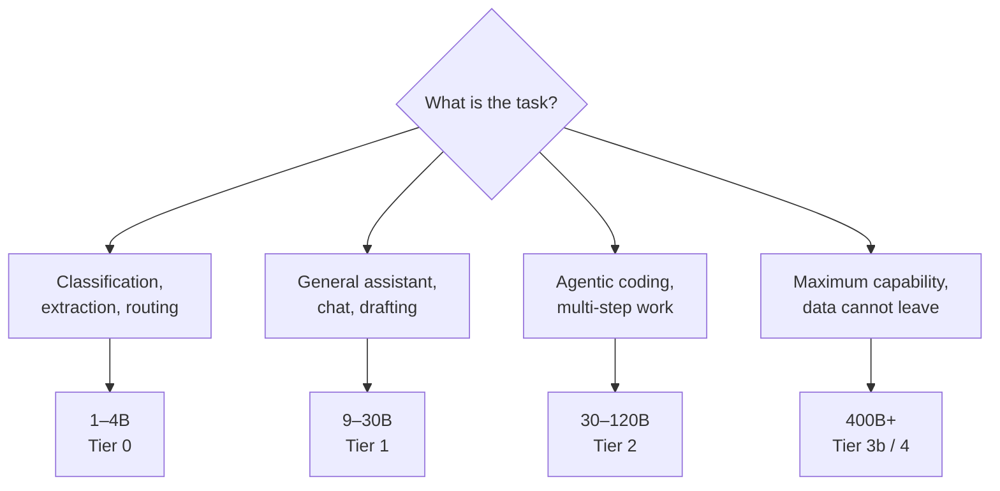

# 8. Every model, and what it costs to run

Most writing about local models starts from a particular machine and asks what fits.
This chapter does the opposite: it lays out the whole range, from models that run on a
phone to models that need a rack, and states the hardware each one requires.

Nothing here is out of reach in principle. Everything is a question of how much memory
you are willing to buy.

## The sizing method

From [Chapter 2](/book/02-size-and-memory), at Q4_K_M each billion parameters costs about
0.55 GB, and you need roughly 20% on top for context and runtime overhead.

$$\text{memory needed} \approx \text{total parameters (B)} \times 0.55 \times 1.2$$

For sparse models, **use the total parameter count, not the active one**
([Chapter 3](/book/03-dense-and-sparse)). All experts must be resident.

| Total parameters | Weights at Q4 | Practical requirement |
| --- | --- | --- |
| 1B | 0.6 GB | 1.5 GB |
| 4B | 2.2 GB | 3.5 GB |
| 8B | 4.4 GB | 6 GB |
| 14B | 7.7 GB | 10 GB |
| 24B | 13 GB | 16 GB |
| 32B | 18 GB | 22 GB |
| 70B | 39 GB | 48 GB |
| 120B | 66 GB | 80 GB |
| 235B | 129 GB | 155 GB |
| 400B | 220 GB | 265 GB |
| 671B | 369 GB | 440 GB |
| 1T | 550 GB | 660 GB |

At Q8 the figures double. At FP16 they quadruple.

## The hardware tiers

| Tier | Hardware | VRAM | Bandwidth | Largest model at Q4 |
| --- | --- | --- | --- | --- |
| **0** | Mobile workstation GPU | 4 GB | ~190 GB/s | 4B dense |
| **1** | RTX 4090 / 3090 | 24 GB | ~1,010 GB/s | 32B dense, 30B sparse |
| **2a** | RTX 5090 | 32 GB | ~1,790 GB/s | 32B dense comfortably |
| **2b** | RTX PRO 6000 Blackwell | 96 GB | ~1,790 GB/s | 120B sparse |
| **3a** | DGX Spark (GB10) | 128 GB unified | ~273 GB/s | 200B sparse |
| **3b** | Mac Studio, M-series Ultra | up to 512 GB unified | ~820 GB/s | **671B sparse** |
| **4a** | 1× H100 SXM | 80 GB HBM3 | ~3,350 GB/s | 120B sparse |
| **4b** | 8× H100 | 640 GB HBM3 | ~3,350 GB/s per GPU | 671B at FP8, production speed |
| **4c** | 8× H200 | 1,128 GB HBM3e | ~4,800 GB/s per GPU | 1T sparse |

Bandwidth figures are approximate and vary by SKU. Compute figures are omitted here
and covered in [Chapter 11](/book/11-reference-architectures), where they affect the
decision.

::: tip The answer to the obvious question
**Yes, you can run the largest open models on your own hardware.** DeepSeek-V3 at 671B
parameters fits in a single Mac Studio with 512 GB of unified memory, at Q4, for around
€10,000 — roughly the price of one H100.

It will generate at a usable rate and process long prompts slowly, for exactly the
reasons set out in [Chapter 4](/book/04-the-gpu). "Not achievable locally" is almost never
true. "Not achievable at this price, at this speed" usually is.
:::

## The model range

### Small — Tier 0 and up

| Model | Size | Notes |
| --- | --- | --- |
| `granite4.2` | 3B | Apache 2.0. Reliable tool calling and JSON output. |
| `qwen3.5` | 0.8B, 2B, 4B | Strong all-rounder, tool calling, thinking mode. |
| `gemma4` | e2B, e4B | Efficient variants built for laptops. Good multilingual. |
| `nemotron-3-nano` | 4B | Tuned for agentic use. |
| `llama3.2` | 1B, 3B | Older; small and predictable. |

Useful for: classification, extraction, summarisation, simple agents, autocomplete.
Not useful for: multi-step reasoning, agentic coding.

### Mid-range — Tier 1

| Model | Size | Notes |
| --- | --- | --- |
| `qwen3.5` | 9B, 27B | The size most people find "good enough" |
| `gemma4` | 12B, 26B | Vision, tools, thinking |
| `granite4.2` | 8B, 30B | Enterprise workloads, RAG |
| `mistral-small3.2` | 24B | Vision and tools |
| `gpt-oss` | 20B sparse | Reasoning and agents |
| `qwen3-coder` | 30B sparse | Code |
| `devstral-small-2` | 24B | Agentic coding |

This tier is the sweet spot for individual developers. A single 24 GB card runs
everything here at 20–50 tokens per second.

### Large — Tier 2 and 3

| Model | Total / active | Q4 memory | Notes |
| --- | --- | --- | --- |
| `llama3.3` | 70B dense | ~48 GB | Long-standing reference point |
| `gpt-oss` | 120B sparse | ~80 GB | Fits one RTX PRO 6000 or one H100 |
| `qwen3-next` | 80B-A3B | ~55 GB | Very fast for its capability |
| `nemotron-3-super` | 120B-A12B | ~80 GB | Multi-agent workloads |
| `mistral-medium-3.5` | 128B | ~85 GB | Vision, tools, thinking |
| `qwen3.5` | 122B sparse | ~82 GB | |

This is where open models start being straightforwardly competitive with hosted
services for most work.

### Frontier open weights — Tier 3b and 4

| Model | Total / active | Q4 memory | Minimum practical hardware |
| --- | --- | --- | --- |
| `llama4` | 400B-A17B | ~265 GB | Mac Studio 512 GB, or 4× H100 |
| `deepseek-v3` | 671B-A37B | ~440 GB | Mac Studio 512 GB, or 8× H100 |
| `kimi-k2` and successors | ~1T-A32B | ~660 GB | 8× H200 |
| `glm-5.x` | not disclosed | — | Rack-scale |

DeepSeek-V3's own documentation recommends SGLang, vLLM or TensorRT-LLM across
multiple nodes, and ships FP8 weights natively. That is the shape of a serious
deployment: not one card, but a coordinated group of them
([Chapter 11](/book/11-reference-architectures)).

## How these compare to hosted frontier models

This is the comparison everyone wants, and it requires care, because half the data does
not exist.

### What is not public

**The parameter counts of closed frontier models are not disclosed.** OpenAI, Anthropic
and Google have published nothing authoritative about the size of their current models.

The one widely-circulated figure is that GPT-4 was approximately 1.8 trillion
parameters in a mixture-of-experts configuration with roughly 280B active. This comes
from industry reporting and claimed leaks, **was never confirmed by OpenAI**, and
concerns a model that is now several generations old. For everything more recent —
GPT-5 and its successors, the Claude and Gemini families — there is no credible public
number at all.

::: warning
Treat any specific parameter count for a closed model as rumour. This book will not
repeat numbers it cannot source.
:::

### What can be compared

Benchmarks, because both open and closed models are evaluated on them.

The broad picture as of this writing: **the largest open-weight models score close to
frontier closed models on most standard benchmarks.** DeepSeek-V3's published results
put it ahead of GPT-4o and Claude 3.5 Sonnet on a majority of coding and mathematics
benchmarks, and its evaluation table is reproducible because the weights are public.

The gap that remains is not primarily in benchmark scores. It is in:

| Dimension | Where closed models still lead |
| --- | --- |
| **Long-horizon agentic reliability** | Sustaining a task over dozens of tool calls without drifting or giving up |
| **Tool-use robustness** | Correct calls, sensible recovery when a call fails |
| **Post-training polish** | Refusal behaviour, formatting, instruction adherence at the margins |
| **The surrounding product** | Retrieval, code execution, memory, orchestration — none of which is the model |

That last row deserves emphasis. A large part of what makes a hosted assistant feel
capable is infrastructure built around the model, not the weights. When you run weights
yourself you get the model and none of the scaffolding; the difference in experience is
larger than the difference in benchmark scores suggests.

### Benchmarks lie, in a specific way

Public benchmarks leak into training data, and vendors optimise for them. A model can
score well and still disappoint on your work.

The only reliable comparison is your own: assemble ten to twenty prompts representative
of the tasks you actually care about, and run candidates against them. This takes an
afternoon and is worth more than any leaderboard. [Chapter 12](/book/12-what-to-learn-next)
expands on this under evaluation.

## Choosing

Two rules that survive every change in the model landscape:

**Start one tier below what you think you need.** Small models are startlingly capable
at well-specified tasks, and the cost difference between tiers is an order of
magnitude.

**Prefer a newer small model to an older large one.** The generation gap usually
exceeds the size gap.
