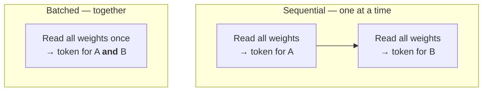
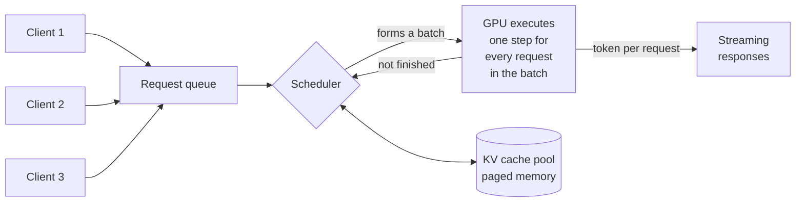

# 10. From one user to many

Everything so far assumed one person asking one question at a time. Sharing a model
changes the engineering completely — not because more hardware is needed, but because
the bottleneck moves.

## Two different problems

**Development** is one person, one request at a time. The metric is latency and tokens
per second for a single stream. A laptop is a development machine.

**Serving** is the model as a shared service: a team, a CI pipeline, or one agent
firing fifty tool calls in a loop. The metric is **throughput** — total tokens per
second across everyone — and whether the system stays responsive under load.

These need different software, and the reason is worth understanding properly, because
it also explains most of the cost structure of hosted APIs.

## Why batching changes everything

Recall from [Chapter 2](/book/02-size-and-memory) that the expensive part of producing a
token is reading the weights out of memory. The arithmetic is cheap; the byte movement
is not.

Now consider two requests arriving at once.

Processed sequentially, the weights are read twice. Processed together, they are read
**once**, and the same bytes serve both requests. The extra arithmetic for the second
request is nearly free, because the hardware was waiting on memory anyway.

The consequence is dramatic and counterintuitive:

::: tip The batching rule
Twenty concurrent users cost far less than twenty times one user. On a well-utilised
server, throughput can be an order of magnitude higher than sequential processing for
the same hardware.
:::

This only happens if the serving software implements it. **Continuous batching** — where
new requests join an in-flight batch instead of waiting for it to finish — is the
feature that separates a production inference server from a development tool.

It also explains why hosted APIs are cheap. Providers run enormous batches; you are
paying a share of a heavily amortised cost.

## What the server actually does

A production inference server is a scheduler wrapped around a model.

Each iteration, the scheduler decides which of the waiting and in-flight requests go
into the next batch. It is balancing three things:

- **KV cache memory.** Every active request holds context ([Chapter 2](/book/02-size-and-memory)). The cache pool, not compute, is usually what limits how many requests fit at once.
- **Fairness.** A long generation should not starve short ones.
- **Prefill against decode.** A newly-arrived long prompt needs a big compute burst ([Chapter 4](/book/04-the-gpu)) which stalls everyone else's token stream if scheduled carelessly.

**Paged attention** is the technique that makes this tractable. Instead of reserving a
contiguous block of memory for each request's maximum possible context, the cache is
allocated in small pages on demand — the same idea as virtual memory in an operating
system. It typically doubles or triples the number of concurrent requests that fit.

You do not need to implement any of this. You do need to recognise that a tool which
lacks it will not scale, no matter how much hardware you give it.

## Serving stacks

| Stack | Use when | Trade-off |
| --- | --- | --- |
| **Ollama** | Development, one user, experimentation | Trivial setup, model management, automatic CPU/GPU splitting. Requests are largely serialised. |
| **vLLM** | Production serving | Continuous batching and paged attention. Model must fit in VRAM; no CPU offload. More operational work. |
| **SGLang** | Production, especially large sparse models | Comparable to vLLM; often faster on MoE. Less mature ecosystem. |
| **llama.cpp** | Unusual hardware, CPU/GPU splitting, exotic quantization | Maximum flexibility, lower throughput. Ollama is built on it. |
| **TensorRT-LLM** | Maximum performance on NVIDIA | Fastest where it applies. Compilation step, NVIDIA-only, least flexible. |

The move from Ollama to vLLM is the move from "one person experimenting" to "a team
sharing a machine". It is the single most important transition in this book, and it is
usually prompted by a specific symptom: the second person starts using the box and both
of them notice.

::: warning A trap when switching
Ollama transparently splits a too-large model between GPU and CPU. vLLM does not — it
requires the model to fit in VRAM and fails at startup otherwise.

A model that "worked" under Ollama may simply refuse to load under vLLM. This is not a
regression. Ollama was quietly running it at a tenth of the speed.
:::

## What changes as you grow

| | One user | A team | Several teams |
| --- | --- | --- | --- |
| Stack | Ollama | vLLM | vLLM behind a gateway |
| Bottleneck | VRAM capacity | KV cache pool | Aggregate throughput |
| Failure mode | Model will not load | Queue latency grows | Noisy-neighbour contention |
| Needs | Nothing | Monitoring | Routing, quotas, authentication, multiple models |

Two pieces of infrastructure become necessary at the third column and are premature
before it:

**A gateway** — an OpenAI-compatible endpoint in front of several backends, handling
authentication, routing by model name, rate limits and usage accounting. LiteLLM is the
common choice.

**Per-model deployments.** Serving three models from one process serves all three
badly. Give each its own GPU or its own node, and route by model name at the gateway.

## Measuring

Four numbers describe a serving system. Track all of them; any one alone will mislead.

| Metric | Meaning | Why it matters |
| --- | --- | --- |
| **Time to first token** | Latency of the prefill phase | What users perceive as responsiveness |
| **Inter-token latency** | Time between subsequent tokens | What users perceive as speed |
| **Throughput** | Total tokens per second, all requests | What the hardware is worth |
| **KV cache utilisation** | Fraction of the cache pool in use | The leading indicator of queueing |

Cache utilisation is the one people omit and then wish they had. It saturates before
throughput does, and it is the earliest warning that capacity is running out.

The next chapter turns all of this into three concrete builds.
