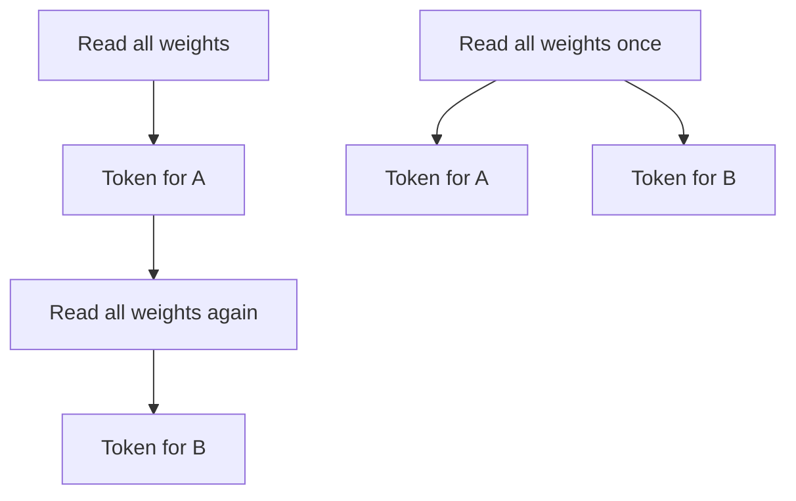
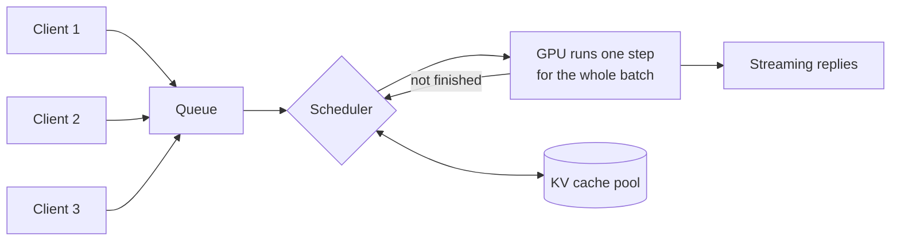
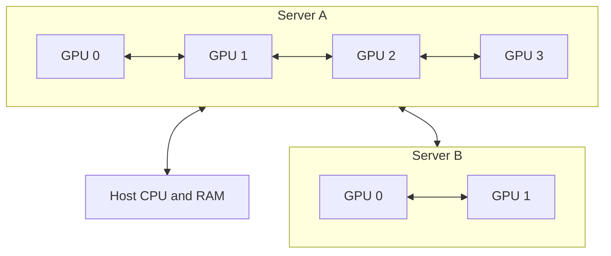

# 10. From one user to many

Everything so far assumed one person asking one question at a time. Sharing a model
changes the engineering completely — not because more hardware is needed, but because
the bottleneck moves.

## Two different problems

**Development** is one person, one request at a time. The metric is latency and tokens
per second for a single stream. A laptop is a development machine.

**Serving** is the model as a shared service: a team, a CI pipeline, or one agent
firing fifty tool calls in a loop. The metric is **throughput** — total tokens per
second across everyone — and whether the system stays responsive under load.

These need different software, and the reason is worth understanding properly, because
it also explains most of the cost structure of hosted APIs.

## Why batching changes everything

Recall from [Chapter 2](/book/02-size-and-memory) that the expensive part of producing a
token is reading the weights out of memory. The arithmetic is cheap; the byte movement
is not.

Now consider two requests arriving at once.

The top row is sequential, the bottom row batched.

Processed sequentially, the weights are read twice. Processed together, they are read
**once**, and the same bytes serve both requests. The extra arithmetic for the second
request is nearly free, because the hardware was waiting on memory anyway.

The result is dramatic, and the opposite of what most people expect:

::: tip The batching rule
Twenty concurrent users cost far less than twenty times one user. On a busy server,
throughput can be an order of magnitude higher than sequential processing for
the same hardware.
:::

This only happens if the serving software implements it. **Continuous batching** — where
new requests join an in-flight batch instead of waiting for it to finish — is the
feature that separates a production inference server from a development tool.

It also explains why hosted APIs are cheap. Providers run enormous batches; you are
paying a share of a cost spread across a great many people.

## What the server actually does

A production inference server is a scheduler wrapped around a model.

Each iteration, the scheduler decides which of the waiting and in-flight requests go
into the next batch. It is balancing three things:

- **KV cache memory.** Every active request holds context ([Chapter 2](/book/02-size-and-memory)). The cache pool, not compute, is usually what limits how many requests fit at once.
- **Fairness.** A long generation should not starve short ones.
- **Prefill against decode.** A newly-arrived long prompt needs a big compute burst ([Chapter 4](/book/04-the-gpu)) which stalls everyone else's token stream if scheduled carelessly.

**Paged attention** is the technique that makes this workable. Instead of reserving one
contiguous block of memory for each request's largest possible context, the cache is
handed out in small pages as it is needed — the same idea as virtual memory in an
operating system. It typically doubles or triples the number of requests that fit at once.

You do not need to implement any of this. You do need to recognise that a tool which
lacks it will not scale, however much hardware you give it.

## How many people can share one card?

This is the question every capacity plan turns on, and it has a simple answer.

Whatever GPU memory is left after the weights becomes the **KV cache pool**. Divide it by
what one user's context costs:

$$\text{concurrent users} \approx \frac{\text{GPU memory} - \text{model weights}}{\text{cache per user}}$$

Using the per-token figures from [Chapter 2](/book/02-size-and-memory), a 96 GB card
running a 70B model at Q4 (39 GB of weights, leaving about 56 GB) works out as:

| Context per user | Cache per user | Users served at once |
| --- | --- | --- |
| 32K | 5 GB | ~11 |
| 128K | 21 GB | ~2 |
| 256K | 42 GB | ~1 |
| 1M | 164 GB | **0 — will not fit even once** |

Those last two rows are the context windows current models actually advertise
([Chapter 8](/book/08-the-model-landscape)), which is the uncomfortable part: a 96 GB
card running a conventional 70B model cannot give a single user the window the model
claims to support.

**The escape is the model, not the card.** Architectures built for long context
([Chapter 2](/book/02-size-and-memory)) cut the per-token cost by anything from a factor
of four to a factor of a hundred, depending on which method they use. At the aggressive
end the same 56 GB pool seats hundreds of people at 256K instead of one.

That range is too wide to assume. Look the figure up for the specific model you intend
to deploy before you size anything around it.

::: tip The trade nobody mentions
With conventional attention, context length and user count are the same budget. You can
serve a lot of people with short contexts, or very few with long ones.

If a team asks for both "a 256K window" and "everyone can use it at once", on a
conventional model those are two different machines. On a model built for long context
they can be the same machine. Check which kind you are deploying before you price the
hardware.
:::

A gentler option than buying more hardware: cap the configured context at what the work
needs. Dropping from 128K to 32K on the example above takes the same card from two users
to eleven.

### Reusing the cache instead of recomputing it

When many requests begin the same way — a long system prompt, a codebase, a document the
whole team asks about — the cache for that shared opening can be computed once and reused
rather than rebuilt per request. This is **prefix caching**, and every serious serving
stack supports it.

It can go further. Runtimes such as **LMCache**, which vLLM ships connectors for, keep
those caches in tiers: GPU memory first, then system RAM, then a local SSD, then shared
storage. A prefix that no longer fits on the card is fetched instead of recomputed.

Be precise about what this buys, because it is routinely oversold:

| | |
| --- | --- |
| **Improves** | Time to first token, dramatically, whenever a prefix repeats |
| **Does not improve** | The context of the conversation happening right now |

The active request's cache still has to sit in GPU memory. An SSD delivers a few
gigabytes per second where GPU memory delivers hundreds, so nothing the model consults on
*every* token can live on a disk. Offloading works precisely because the data it moves is
cold — needed once at the start of a request, not continuously throughout it.

So it is a strong answer to "fifty people share one long system prompt", and no answer at
all to "I want a million-token conversation on a small card".

## Serving stacks

| Stack | Use when | Trade-off |
| --- | --- | --- |
| **Ollama** | Development, one user, experimentation | Trivial setup, model management, automatic CPU/GPU splitting. Requests are largely serialised. |
| **vLLM** | Production serving | Continuous batching and paged attention. Model must fit in VRAM; no CPU offload. More operational work. |
| **SGLang** | Production, especially large sparse models | Comparable to vLLM; often faster on MoE. Less mature ecosystem. |
| **llama.cpp** | Unusual hardware, CPU/GPU splitting, exotic quantization | Maximum flexibility, lower throughput. Ollama is built on it. |
| **TensorRT-LLM** | Maximum performance on NVIDIA | Fastest where it applies. Compilation step, NVIDIA-only, least flexible. |

The move from Ollama to vLLM is the move from "one person experimenting" to "a team
sharing a machine". It is the single most important transition in this book, and it is
usually prompted by a specific symptom: the second person starts using the box and both
of them notice.

::: warning A trap when switching
Ollama transparently splits a too-large model between GPU and CPU. vLLM does not — it
requires the model to fit in VRAM and fails at startup otherwise.

A model that "worked" under Ollama may simply refuse to load under vLLM. This is not a
regression. Ollama was quietly running it at a tenth of the speed.
:::

## What changes as you grow

| | One user | A team | Several teams |
| --- | --- | --- | --- |
| Stack | Ollama | vLLM | vLLM behind a gateway |
| Bottleneck | VRAM capacity | KV cache pool | Aggregate throughput |
| Failure mode | Model will not load | Queue latency grows | Noisy-neighbour contention |
| Needs | Nothing | Monitoring | Routing, quotas, authentication, multiple models |

Two pieces of infrastructure become necessary at the third column and are premature
before it:

**A gateway.** One address that every client talks to, sitting in front of several
inference servers. It answers the same OpenAI-compatible API the servers do, so nothing
on the client side has to know it exists. Its job is the work no inference server does:
checking who is calling, sending the request to whichever server holds the requested
model, enforcing per-team limits, and recording usage so you can answer "what does this
cost and who is spending it".

**LiteLLM** is the usual choice — an open-source gateway that speaks the OpenAI API on
the front and translates to whatever is behind it, whether that is vLLM on your own
hardware or a commercial provider. Being able to mix both behind one endpoint is the
main reason people pick it: teams keep one URL and one key while you change what runs
underneath.

**Per-model deployments.** Serving three models from one process serves all three
badly. Give each its own GPU or its own node, and route by model name at the gateway.

## Beyond one card

Once a deployment outgrows a single GPU, how the GPUs are wired starts to matter, and
the differences span orders of magnitude.

Inside a server the GPUs are joined by NVLink. Between servers they are joined by the
network. The gap between those two is the whole point:

| Link | Bandwidth | Where it is used |
| --- | --- | --- |
| NVLink | up to ~900 GB/s | GPU to GPU inside one chassis |
| PCIe 5.0 ×16 | ~64 GB/s | GPU to host, and GPU to GPU without NVLink |
| InfiniBand NDR | ~50 GB/s | Server to server in a purpose-built cluster |
| ConnectX, 400G QSFP112 | ~50 GB/s | Joining small AI appliances directly |
| 100 GbE | ~12 GB/s | Server to server, commodity networking |
| 10 GbE | ~1.2 GB/s | An ordinary office network |

NVLink is roughly **750 times faster** than an ordinary office network. That ratio is why
"just plug several PCs into the office switch" is not a strategy — though the fourth row
is a real exception, and [Chapter 11](/book/11-reference-architectures) prices it.

### Splitting a model across GPUs

Three ways, and they are not interchangeable.

| Strategy | What it does | Interconnect required | Use for |
| --- | --- | --- | --- |
| **Tensor parallel** | Each layer is split across GPUs; they exchange data at every layer | NVLink. Very heavy traffic. | One model too large for one GPU, within a node |
| **Pipeline parallel** | Different layers on different GPUs; activations pass along the chain | Tolerates slower links | Spanning nodes when unavoidable |
| **Data parallel** | Full copy on each GPU; requests distributed between them | None — they never talk | **Throughput.** The usual answer. |

::: tip The rule
Tensor parallelism inside a node, data parallelism between nodes.

Pipeline parallelism across a slow network is a last resort, chosen only when a model
genuinely cannot fit any other way.
:::

::: warning Scale up before you scale out
One box with one large GPU beats several boxes with small ones for speed, and for the
amount of your life spent on it. Split a model across two machines joined by 10 GbE and
intermediate results cross a 1.2 GB/s link on every token: the GPUs idle while the
network works, and the result is routinely slower than a smaller model on one machine.

Add machines to serve more users, or to hold a model that will not fit. Never add them
to make one model faster.
:::

## Measuring

Four numbers describe a serving system. Track all of them; any one alone will mislead.

| Metric | Meaning | Why it matters |
| --- | --- | --- |
| **Time to first token** | Latency of the prefill phase | What users perceive as responsiveness |
| **Inter-token latency** | Time between subsequent tokens | What users perceive as speed |
| **Throughput** | Total tokens per second, all requests | What the hardware is worth |
| **KV cache utilisation** | Fraction of the cache pool in use | The leading indicator of queueing |

Cache utilisation is the one people omit and then wish they had. It saturates before
throughput does, and it is the earliest warning that capacity is running out.

The next chapter turns all of this into three concrete builds.
