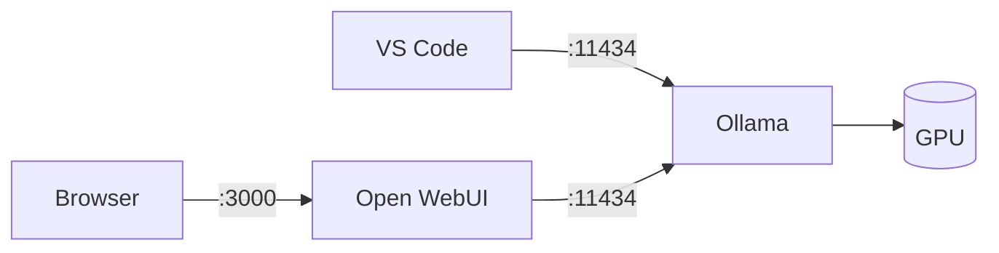
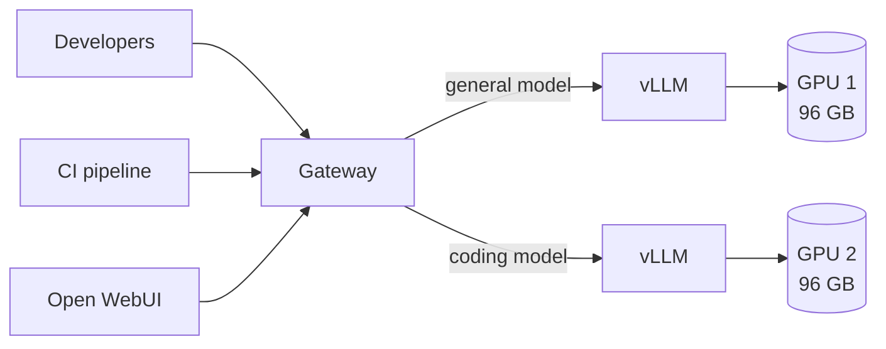
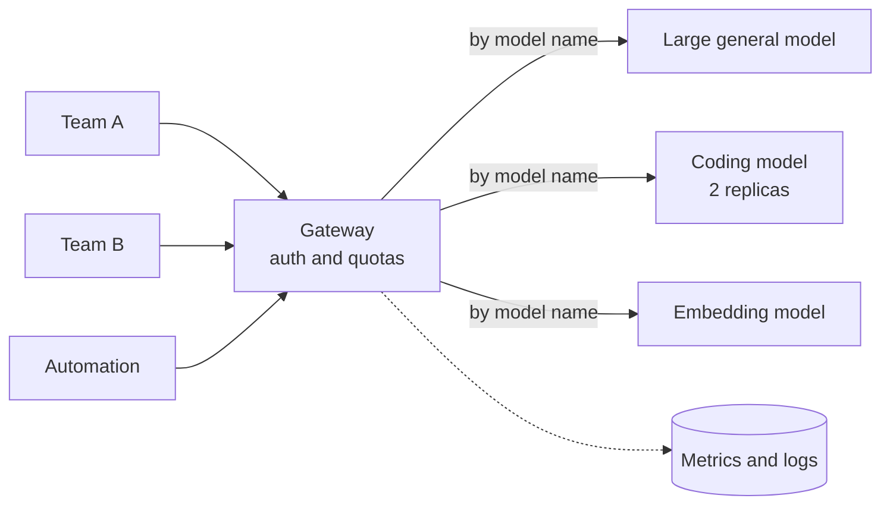
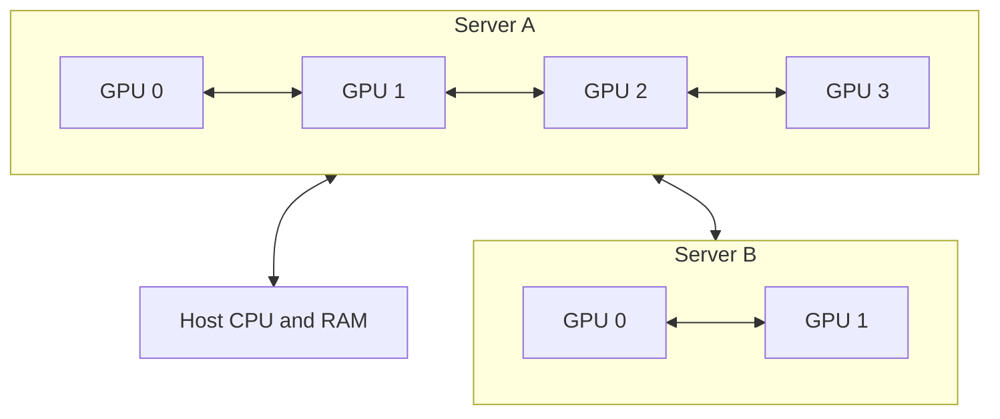

# 11. Reference architectures

Three concrete builds: one person, one team, several teams. Each with the hardware, the
wiring, the cost, and the models it can actually run.

## The hardware reference

Everything in this chapter draws on this table. Bandwidth is included because it
determines generation speed, and compute because it determines prompt processing speed
— the two are independent, and hardware is routinely good at one and poor at the other.

| Device | Memory | Bandwidth | FP16 compute | Price (EUR) |
| --- | --- | --- | --- | --- |
| Laptop workstation GPU | 4 GB GDDR6 | ~190 GB/s | ~40 TFLOPS | in-laptop |
| RTX 5070 Ti | 16 GB GDDR7 | ~900 GB/s | ~175 TFLOPS | ~1,100 |
| AMD Radeon AI PRO R9700 | 32 GB GDDR6 | ~640 GB/s | ~95 TFLOPS | ~1,700 |
| Mac Studio, M5 Max | 36–128 GB unified | ~614 GB/s | not published | from ~2,900 |
| DGX Spark (GB10) | 128 GB unified | ~273 GB/s | ~125 TFLOPS | 4,600–6,000 |
| RTX 5090 | 32 GB GDDR7 | ~1,790 GB/s | ~210 TFLOPS | 5,200–6,800 |
| Mac Studio, M5 Ultra | 96–512 GB unified | ~1,200 GB/s | not published | from ~6,500 |
| AMD Instinct MI210 | 64 GB HBM2e | ~1,600 GB/s | ~180 TFLOPS | ~9,200 |
| RTX PRO 6000 Blackwell | 96 GB GDDR7 ECC | ~1,790 GB/s | ~250 TFLOPS | from 18,000 |
| H200 NVL | 141 GB HBM3 | ~4,800 GB/s | ~990 TFLOPS | 35,000–37,000 |

**Prices** are the cheapest listed European retail offer including VAT, taken in
September 2026 from a price-comparison site, and from the Apple store for the Mac
Studio. They are the first thing in this book that will go stale. Read them as ratios,
not as quotes.

**Specifications** are approximate and vary by SKU. Compute is dense FP16/BF16 — vendor
sheets often quote double these figures "with sparsity", which does not apply to
ordinary inference. Apple publishes no FP16 number for M-series chips at all, which is
itself worth knowing: that row cannot be looked up, only measured.

Two older parts have been dropped from this table and are worth a line each. The
**RTX 4090** remains a sensible used-market buy at 24 GB. The **H100** is no longer
sold at retail in Europe and is being displaced by the H200; if someone offers you one,
price it against an H200 rather than against its launch price.

### Two prices worth staring at

**Single-card memory is the most expensive commodity in this book.** An RTX PRO 6000
has three times the memory of an RTX 5090 and almost identical bandwidth, for roughly
three times the money. The 5090 has itself drifted far above its launch price.

**The cheapest memory is not NVIDIA's.**

| Card | Memory | Price | Per GB |
| --- | --- | --- | --- |
| AMD Radeon AI PRO R9700 | 32 GB | ~€1,700 | **~€53** |
| RTX 5090 | 32 GB | ~€5,200 | ~€163 |
| RTX PRO 6000 Blackwell | 96 GB | ~€18,000 | ~€188 |
| H200 NVL | 141 GB | ~€35,000 | ~€249 |

A gigabyte of VRAM on an AMD workstation card costs about a quarter of what it costs on
the NVIDIA equivalent, and the R9700 is a dual-slot blower design, so several fit in one
chassis.

The catch is software, not silicon. AMD cards run through **ROCm** rather than CUDA.
llama.cpp and vLLM both support it and ordinary inference works, but you will meet
rougher edges, fewer prebuilt containers, and a steady trickle of projects that assume
CUDA exists. That is the trade: pay AMD less money, or pay NVIDIA more and spend less of
your own time. Choose it deliberately rather than by default.

### The two unified-memory machines fail differently

The Mac Studio and the DGX Spark both sell the same headline: far more memory per euro
than any graphics card. They are not, however, the same trade, and the table above shows
why if you read the two middle columns together.

**The Mac Studio has bandwidth and lacks compute.** An M5 Ultra moves 1.2 TB/s, a
quarter of an H200 and more than half an RTX PRO 6000. Generation, which is bandwidth
work, is genuinely quick. Prefill is arithmetic work, and Apple's chips have far less
arithmetic throughput than a datacenter part.

**The DGX Spark has compute and lacks bandwidth.** 273 GB/s is the lowest figure in the
table by a wide margin — less than a sixth of an RTX 5090. It will read a long prompt at
a respectable rate and then write the answer slowly.

Prefill ([Chapter 4](/book/04-the-gpu)) processes every prompt token in parallel, so its
cost is arithmetic:

$$\text{prefill FLOPs} \approx 2 \times \text{active parameters} \times \text{prompt tokens}$$

Take a 70B dense model and a 32,000-token prompt — a medium-sized codebase, or a long
document:

$$2 \times 70 \times 10^9 \times 32 \times 10^3 = 4.5 \times 10^{15}\ \text{FLOPs}$$

| Hardware | Compute | Theoretical | Realistic (~35% efficiency) |
| --- | --- | --- | --- |
| H200 NVL | ~990 TFLOPS | 4.5 s | ~13 s |
| RTX PRO 6000 | ~250 TFLOPS | 18 s | ~50 s |
| DGX Spark | ~125 TFLOPS | 36 s | ~1.7 minutes |
| Mac Studio M5 Ultra | not published | — | measure it |

Generation runs the other way, and it is a simple division of bandwidth by model size.
The same 70B model at Q4 is about 39 GB:

| Hardware | Bandwidth | Generation ceiling |
| --- | --- | --- |
| H200 NVL | ~4,800 GB/s | ~120 tok/s |
| RTX PRO 6000 | ~1,790 GB/s | ~46 tok/s |
| Mac Studio M5 Ultra | ~1,200 GB/s | ~30 tok/s |
| DGX Spark | ~273 GB/s | ~7 tok/s |

Put the two tables side by side and the advice writes itself. A Mac Studio is pleasant
in conversation and painful the moment you paste in something large. A DGX Spark reads
quickly and then dribbles the answer out at about the speed you read, which is fine for
a person watching the screen and hopeless for an agent
([Chapter 2](/book/02-size-and-memory)).

Neither is a bad machine. Both are bad *general* machines, and the failure mode is
invisible in the specification sheet unless you know which column governs which half of
the work.

::: warning Apple publishes no compute figure
There is no FP16 TFLOPS number on Apple's specification page, and third-party
measurements vary with the framework used. If prompt-heavy work is your reason for
buying one, benchmark the exact model you intend to run before committing. The method is
in [Chapter 6](/book/06-the-first-run).
:::

## Architecture A — one person

Everything on one machine, as built in [Chapter 6](/book/06-the-first-run).

| | Entry | Serious |
| --- | --- | --- |
| Hardware | Existing laptop, 4 GB | Workstation, one 32 GB card |
| Cost | 0 | €3,200 with a Radeon R9700, €6,700 with an RTX 5090 |
| Stack | Ollama + Open WebUI | Same |
| Good for | Learning, light assistance | Daily use, agentic coding on one repository |

Both cards hold 32 GB, and that is the only thing they have in common. The RTX 5090 has
close to three times the bandwidth, so it generates close to three times faster; the
Radeon costs a third as much and runs on ROCm. For one person deciding how much to
spend, that is the entire question.

### What to expect from it

On a 32 GB card, running a 32B dense model at Q4 (18 GB of weights, leaving ~13 GB):

| | RTX 5090 | Radeon AI PRO R9700 |
| --- | --- | --- |
| Bandwidth | ~1,790 GB/s | ~640 GB/s |
| Generation ceiling | ~99 tok/s | ~35 tok/s |
| Realistic generation | 50–70 tok/s | 20–25 tok/s |

Both are comfortably faster than a person reads
([Chapter 2](/book/02-size-and-memory)). Only the agentic case separates them, and there
the faster card earns its money back in minutes saved per task.

Context behaves the same way on either:

| Configured context | Cache | Total with 18 GB of weights | Fits in 32 GB? |
| --- | --- | --- | --- |
| 32K | 4 GB | 22 GB | Yes |
| 128K | 17 GB | 35 GB | No |
| 256K | 34 GB | 52 GB | No |

The last row is the useful one, and it is worse than it looks. A 32B model of this kind
advertises a 256K window; the card that runs the model comfortably cannot reach that
window at all. Context is bought in GPU memory, not configured for free — unless the
model was designed to avoid the cost ([Chapter 2](/book/02-size-and-memory)).

The jump from the entry column to the serious one is the best value in this chapter. One
card moves you from "interesting toy" to "genuinely useful" for about the price of a
laptop.

**Do not scale this by adding people.** Ollama serialises requests
([Chapter 10](/book/10-from-one-user-to-many)); the second concurrent user halves
everyone's speed.

## Architecture B — one team

Five to fifteen developers sharing one server.

The gateway handles authentication, routing and quotas
([Chapter 10](/book/10-from-one-user-to-many)).

**Hardware.** One server with two 96 GB workstation cards — 192 GB of GPU memory in
total, about 1,790 GB/s each, in a standard chassis with ordinary power and cooling.

| Item | Cost (EUR) |
| --- | --- |
| 2× RTX PRO 6000 Blackwell, 96 GB | 36,000 |
| Chassis, CPU, 256 GB RAM, NVMe | 5,000–7,000 |
| **Capital total** | **41,000–43,000** |
| Power, ~1.5 kW at €0.25/kWh | ~270/month |
| Spread over 3 years | ~1,170/month |
| **Running total** | **~1,450/month** |

::: warning The cards are most of the cost
Nine tenths of the capital here is two pieces of silicon. Every other decision in this
build — chassis, CPU, memory, disks — is rounding error by comparison. Spend your
deliberation accordingly.
:::

### The same memory for less than half the money

Six Radeon AI PRO R9700 cards also come to 192 GB, and cost about a quarter of what the
two NVIDIA cards cost.

| | 2× RTX PRO 6000 | 6× Radeon AI PRO R9700 |
| --- | --- | --- |
| Total GPU memory | 192 GB | 192 GB |
| Memory per card | 96 GB | 32 GB |
| Card cost | ~€36,000 | ~€10,100 |
| Capital total | €41,000–43,000 | €16,000–18,000 |
| Power | ~1.5 kW | ~2.1 kW |
| Running total | ~€1,450/month | ~€850/month |
| Software | CUDA | ROCm |

The totals are equal and the builds are not, because **what matters is the largest
single chunk, not the sum.** A 96 GB card holds a 120B sparse model on its own. A 32 GB
card holds nothing larger than about a 50B model at Q4, so the same 120B model has to be
split across four cards over PCIe — no NVLink exists on either of these workstation
parts — and tensor parallelism over PCIe costs real speed
([below](#splitting-a-model-across-gpus)).

So the choice is genuine rather than obvious:

- **Several mid-size models, many users.** The AMD build wins clearly. Each card runs
  its own model, the cards never talk to each other, and you save €25,000.
- **One large model.** The NVIDIA build wins clearly. Fewer, bigger chunks is the whole
  game, and the interconnect problem never arises.

This is the single largest cost decision in the book, and it turns on a question about
your workload rather than a question about hardware.

**What it runs.** Each card independently holds a model up to about 120B sparse at Q4.
The usual split is a general model on one card and a coding model on the other.

The two cards are deliberately **not** joined to run one larger model. Two independent
models serving two workloads is worth more to a team than one bigger model, and it keeps
the interconnect out of the design entirely.

### What to expect from it

Taking `nemotron-3-super` (124B-A12B) on one card — 68 GB of weights, leaving about
28 GB for the KV cache pool. This model uses conventional attention, so the figures from
[Chapter 2](/book/02-size-and-memory) apply at roughly 220 MB per thousand tokens:

| Configured context | Cache per user | Users served at once |
| --- | --- | --- |
| 32K | 7 GB | ~4 |
| 128K | 29 GB | ~1 |
| 256K | 58 GB | **does not fit at all** |

Read the last row twice. A card with 96 GB of memory cannot serve **one** user at the
context window that current models now advertise as ordinary
([Chapter 8](/book/08-the-model-landscape)). Conventional attention and modern context
windows are close to incompatible on single-card hardware.

This is the practical reason a model's architecture now matters more than its size. At
DeepSeek-V4.1-Flash's 890 bytes per token, that same 28 GB pool would hold a 256K context
for over a hundred users, or a full million-token context for thirty. Same memory, two
hundred times the seats, from a design decision rather than a purchase.

**Generation speed** hardly changes down the rows, because it follows bandwidth and the
model's active parameters rather than context length. For this model on this card, the
bounds from [Chapter 3](/book/03-dense-and-sparse) are roughly 270 tokens per second
optimistic and 26 pessimistic — a wide gap, which is exactly why that chapter says to
measure sparse models rather than trust the arithmetic. Expect comfortably more than a
reader needs, and confirm it on your own hardware before promising anyone a number.

The first-word figures follow the model's 12B active parameters rather than its 124B
total. A dense 70B model on the same card would take roughly six times longer on the same
prompt. This is the strongest practical argument for sparse models in a shared
deployment.

**What is now required that was not before:** monitoring (the four metrics from
[Chapter 10](/book/10-from-one-user-to-many)), a gateway, and someone whose job includes
keeping it running.

## Architecture C — several teams

Fifty or more users, several models, uptime expectations.

### The budget version first

The obvious build here is a node of eight datacenter accelerators. It is also, for most
organisations, the wrong one — three hundred thousand euros, ten kilowatts, and a server
room. Start lower.

**Four 96 GB workstation cards in one server** give you 384 GB of GPU memory for roughly
a quarter of that price, in a chassis that lives in an ordinary office.

| Item | Budget build | Datacenter build |
| --- | --- | --- |
| GPUs | 4× RTX PRO 6000, 96 GB | 8× H200 NVL, 141 GB |
| Total GPU memory | 384 GB | 1,128 GB |
| Bandwidth per GPU | ~1,790 GB/s | ~4,800 GB/s |
| Interconnect | PCIe | NVLink |
| Hardware cost | ~€80,000 | ~€300,000 |
| Cost per GB of GPU memory | ~€208 | ~€266 |
| Power | ~3 kW | ~10 kW |
| Cooling | Normal room air | Server room or liquid |
| Spread over 3 years | ~€2,200/month | ~€8,300/month |

Be careful with the comparison, because it is closer than it used to be. The previous
generation of datacenter card held 80 GB; this one holds 141 GB, and eight of them come
to more than a terabyte. **The datacenter build now wins on absolute memory as well as
on bandwidth.** What the budget build still wins is euros per gigabyte, power, and the
fact that it does not require a building project.

::: tip Buy memory before you buy bandwidth
Datacenter accelerators are worth their price when many people hammer one large model at
once, or when a model genuinely will not fit any other way. Below that, workstation
cards give more capability per euro, and the difference funds several years of
operations.
:::

An AMD equivalent exists at this tier too: **eight Instinct MI210 cards** give 512 GB of
HBM2e for roughly €74,000 — more memory than the budget NVIDIA build, at similar money
and similar bandwidth per card. They are passively cooled datacenter parts, so they need
a proper chassis with forced airflow rather than an office corner, and they are an older
generation. Worth a quote if HBM bandwidth matters and ROCm is acceptable.

### About cooling

This is a real constraint, not a footnote. An 8-GPU datacenter node draws around 10 kW
continuously — roughly five domestic kettles, running permanently, all of it turning into
heat in one rack. That needs a room designed for it: dedicated power, forced airflow or
liquid cooling, and often a cooling budget comparable to the power budget.

A 3 kW workstation build plugs into a normal circuit and survives on room air. This
difference alone frequently decides the question, because the datacenter option is not
"the same thing but more expensive" — it is a building project.

### What to expect from it

The same arithmetic as Architecture B, applied to both builds. Taking the largest model
each can hold, and reserving the rest for the cache pool:

**The budget build misses by one card**, and it is worth seeing why. DeepSeek-V4.1-Flash
at Q4 needs about 420 GB of weights. Four 96 GB cards give 384 GB. That is 36 GB short
before reserving a single byte for the cache, so this model wants a fifth card.

| | Budget build | Budget plus one card | Datacenter build |
| --- | --- | --- | --- |
| GPU memory | 384 GB | 480 GB | 1,128 GB |
| V4.1-Flash at Q4 (420 GB) | Does not fit | Fits, ~60 GB spare | Fits easily |
| V4.1-Flash at native FP8 (763 GB) | No | No | Fits, ~365 GB spare |
| Hardware cost | ~€80,000 | ~€98,000 | ~€300,000 |

Two lessons, both cheap to learn here and expensive to learn later.

**Size the build around a specific model, not a round number of cards.** "Four cards"
is a budget. "420 GB of weights plus a cache pool" is a requirement. They rarely meet by
accident.

**Quantization is what makes the middle column possible.** The same model is 763 GB as
published and about 420 GB at Q4 ([Chapter 2](/book/02-size-and-memory)). That one
decision is worth more than €200,000 of hardware here.

Once it fits, prompt processing is quick on both, because V4.1-Flash activates only 8B
parameters while reading:

| | Budget plus one card | Datacenter build |
| --- | --- | --- |
| Active parameters at prefill | 8B | 8B |
| Wait before the first word, 32K prompt | ~1.2 s | ~0.2 s |
| Cache for a 1M-token context | under 1 GB | under 1 GB |

That last row is not a misprint. At 890 bytes per token a million-token context costs
less than a gigabyte ([Chapter 2](/book/02-size-and-memory)). On either build the memory
goes almost entirely into weights, and for the first time in this book the number of
people you can serve is limited by something other than context.

::: tip What limits you once context is cheap
When the cache costs almost nothing, concurrency stops being a memory question and
becomes a compute and bandwidth question. Every additional user still needs arithmetic
to prefill their prompt and bandwidth to generate their answer, and no amount of
architectural cleverness removes either.

Plan capacity from the four metrics in
[Chapter 10](/book/10-from-one-user-to-many), not from a cache calculation.
:::

If your teams need a capable model rather than the most capable one, five workstation
cards do the same job for a third of the datacenter price. That is the honest summary of
this section.

### What each runs

| Build | Can hold | Typical deployment |
| --- | --- | --- |
| 4× 96 GB (384 GB) | 400B-class models at Q4 | One large model, or three mid-size models with replicas |
| 5× 96 GB (480 GB) | DeepSeek-V4.1-Flash at Q4 | The current frontier open model, on workstation cards |
| 8× H200 NVL (1,128 GB) | V4.1-Flash at FP8, or V4-Pro at Q4 | The largest open models, at production speed |

With four cards, the common arrangement is not one enormous model but several useful
ones: a large general model on two cards, a coding model on a third, an embedding model
on the fourth. That also sidesteps the interconnect problem entirely, since separate
models never need to talk to each other.

### Renting

At this tier, renting deserves serious thought. Cloud GPU instances run roughly €2–4 per
accelerator-hour. A node used eight hours a day lands near €4,000–6,000 a month — no
capital outlay, no depreciation, no server room.

Buy when the load is steady and the data cannot leave. Rent when it is bursty or you are
still learning what you need.

**What is now required:** orchestration, model versioning, per-team quotas, usage
accounting, and an on-call rotation. The infrastructure around the models exceeds the
models in both complexity and cost.

## How GPUs actually connect

The architectures above depend on how GPUs are wired, and the differences span orders
of magnitude.

Inside a server the GPUs are joined by NVLink. Between servers they are joined by the
network. The gap between those two is the whole point:

| Link | Bandwidth | Where it is used |
| --- | --- | --- |
| NVLink | up to ~900 GB/s | GPU to GPU inside one chassis |
| PCIe 5.0 ×16 | ~64 GB/s | GPU to host, and GPU to GPU without NVLink |
| InfiniBand NDR | ~50 GB/s | Server to server in a purpose-built cluster |
| ConnectX, 400G QSFP112 | ~50 GB/s | Joining DGX Spark units directly |
| 100 GbE | ~12 GB/s | Server to server, commodity networking |
| 10 GbE | ~1.2 GB/s | An ordinary office network |

NVLink is roughly **750 times faster** than an ordinary office network. That ratio is why
"just plug several PCs into the office switch" is not a strategy.

It is no longer the whole story, though, and this book previously overstated it.

### The exception: purpose-built small clusters

The bottom two rows of that table are commodity networking. The fourth row is not. A DGX
Spark ships with a 400 Gb/s ConnectX port, and the direct-attach cable to join two units
costs about **€175** — a rounding error against the machines themselves.

NVIDIA states that one unit runs models up to 200 billion parameters, and that **up to
four units connected this way work with models up to 700 billion parameters.**

So the honest position is narrower than "don't connect machines":

| | Verdict |
| --- | --- |
| Several desktops on 10 GbE | Still a bad idea. The network is 400 times slower than the memory it is feeding. |
| Two to four purpose-built units on 400G | A real option, and a supported one. |
| Many nodes on InfiniBand | A real option, and a specialist's job. |

What the fast cable buys is **capability, not speed**. Four linked Sparks hold a model
that fits in none of them individually; they do not run it four times faster. Each unit
still reads its own weights at 273 GB/s, still the slowest figure in the hardware table,
and cross-unit traffic is added on top. Expect a 700B model spread over four boxes to be
*possible* and *slow*.

::: tip When this is the right answer
A four-unit Spark cluster costs roughly €20,000, draws a few hundred watts, sits under a
desk, and holds a model that would otherwise need a €300,000 server room. If your
requirement is "we must be able to run the large open models at all", it is excellent
value. If your requirement is "fifty people need fast answers", buy one server with big
cards instead.
:::

## Splitting a model across GPUs

Three ways, and they are not interchangeable.

| Strategy | What it does | Interconnect required | Use for |
| --- | --- | --- | --- |
| **Tensor parallel** | Each layer is split across GPUs; they exchange data at every layer | NVLink. Very heavy traffic. | One model too large for one GPU, within a node |
| **Pipeline parallel** | Different layers on different GPUs; activations pass along the chain | Tolerates slower links | Spanning nodes when unavoidable |
| **Data parallel** | Full copy on each GPU; requests distributed between them | None — they never talk | **Throughput.** The usual answer. |

::: tip The rule
Tensor parallelism inside a node, data parallelism between nodes.

Pipeline parallelism across a slow network is a last resort, chosen only when a model
genuinely cannot fit any other way.
:::

A concrete illustration of the trap: splitting a model across two machines joined by
10 GbE means intermediate results cross a 1.2 GB/s link on every token. The GPUs idle
while the network works. The result is routinely slower than running a smaller model on
one machine.

::: warning Scale up before you scale out
One box with one large GPU beats several boxes with small ones for speed, and for the
amount of your life spent on it. The exception above buys *capability* — a model that
fits nowhere else — and still does not buy speed.

Add machines to serve more users, or to hold a model that will not fit. Never add them
to make one model faster.
:::

## How long it takes to start

One number that never appears in a specification and surprises everyone:
**model load time**.

The weights have to travel from disk into GPU memory before the first request. That is a
straight division:

$$\text{load time} \approx \frac{\text{model size in GB}}{\text{disk read speed in GB/s}}$$

| Model | Size at Q4 | On NVMe (~5 GB/s) | On SATA SSD (~0.5 GB/s) |
| --- | --- | --- | --- |
| 32B | 18 GB | ~4 s | ~36 s |
| 120B | 66 GB | ~13 s | ~2 min |
| 400B | 220 GB | ~45 s | ~7 min |

This matters in three situations, and not at all otherwise:

- **Switching models on one card.** Every switch pays the full cost. If two teams want
  different models on the same GPU, they will spend their day waiting. Give each model
  its own card instead.
- **Restarts.** A four-minute restart is a different operational story from a
  four-second one when something has broken and people are waiting.
- **Autoscaling.** Anything that starts a model in response to load inherits this delay.
  It is usually why "scale to zero" is a bad idea for inference.

Storage is otherwise irrelevant to inference speed, which is why it appears nowhere else
in this book. Buy NVMe anyway; it costs little and removes the problem.

## Local against API

The decision is not primarily financial, but the arithmetic is worth doing.

A single heavy user of a hosted service might spend €100–200 per month. Architecture B
costs about €900 per month all-in, so it breaks even somewhere around five to nine
heavy users — at which point it also offers unlimited volume, fixed costs, and data
that never leaves the building.

But the comparison is not like for like:

| Local wins on | API wins on |
| --- | --- |
| Data that cannot leave the premises | Capability per euro at low volume |
| Regulatory and contractual constraints | Zero operational burden |
| Air-gapped environments | Bursty, unpredictable demand |
| High, steady volume | Access to frontier models |
| Fixed, predictable cost | No capital commitment, no depreciation |

Most organisations end up running both: local for sensitive and routine work, hosted
for the genuinely hard problems. That is a sound outcome, not a failure to commit.

## The cost people forget

A GPU server is a server. That operational cost is regularly larger than the hardware,
and it is almost always left out of the comparison. Include it before the meeting, not
after.

It is worth being concrete about what the job actually is, because "someone to look after
it" is too vague to budget for.

**Setting it up** — a few days. Driver and CUDA stack, serving software, gateway,
authentication, monitoring, and getting the first model to serve a team reliably. Mostly
ordinary Linux administration; nothing here needs a machine learning background.

**Keeping it running** — the recurring work:

| Task | How often | What it involves |
| --- | --- | --- |
| Watching capacity | Weekly | Reading the four metrics from [Chapter 10](/book/10-from-one-user-to-many); noticing the cache pool saturating before users complain |
| Model updates | Monthly-ish | Checking a new release behaves on your own tasks before swapping it in |
| Driver and stack upgrades | Quarterly | The riskiest routine task, because a bad driver fails quietly |
| Access and quotas | Ongoing | Adding people, adjusting limits, answering "why is it slow today" |
| Incidents | Unpredictable | Usually one of the four failures above |

**Realistically** this is a fraction of one person: something like 20–30% of an engineer
for a single-server deployment once it is stable, rising sharply if you run several nodes
or promise uptime to other teams. The work is closest to platform or infrastructure
engineering, and someone who already runs internal services will find nothing unfamiliar
in it.

Two things make it much worse than that estimate: having no evaluation set, so every
model change is a guess; and having no monitoring, so every problem is first reported by
a user. Both are cheap to fix at the start and expensive to add later.
