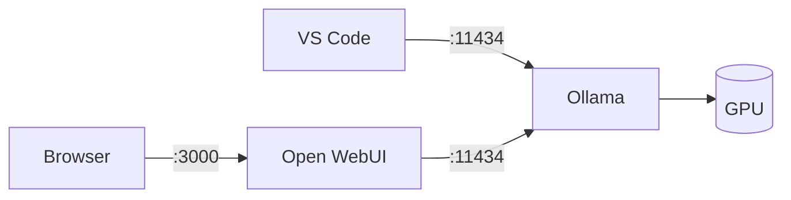
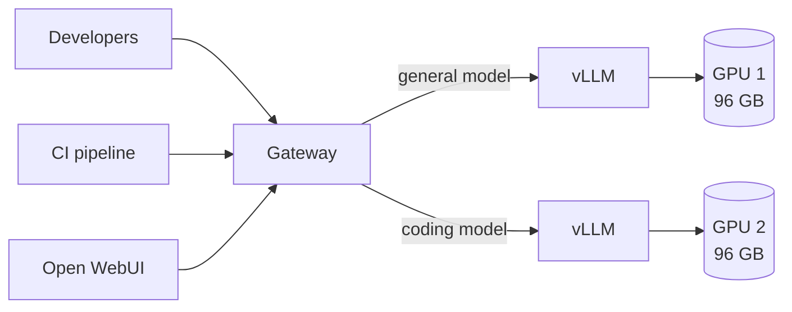
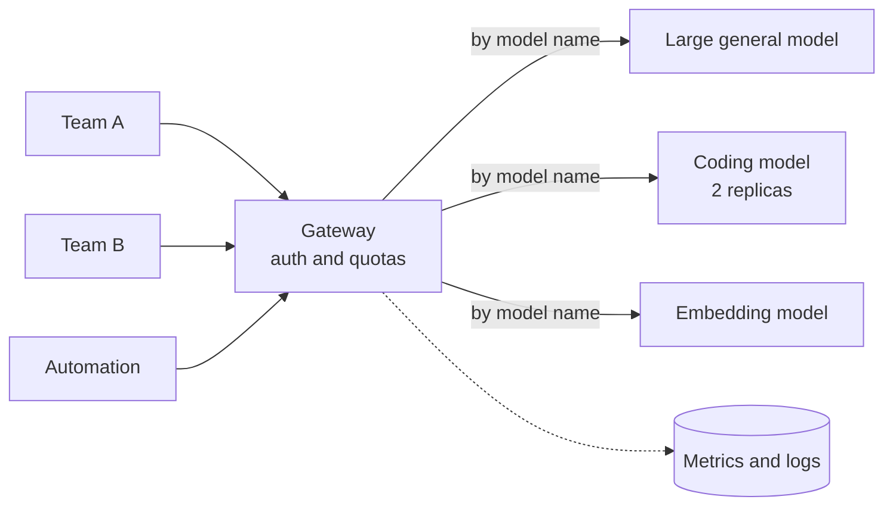

# 11. Reference architectures

Three concrete builds: one person, one team, several teams. Each with the hardware, the
wiring, the cost, and the models it can actually run.

## The hardware reference

Everything in this chapter draws on this table. Bandwidth is included because it
determines generation speed, and compute because it determines prompt processing speed
— the two are independent, and hardware is routinely good at one and poor at the other.

| Device | Memory | Bandwidth | FP16 compute | Price (EUR) |
| --- | --- | --- | --- | --- |
| Laptop workstation GPU | 4 GB GDDR6 | ~190 GB/s | ~40 TFLOPS | in-laptop |
| RTX 5070 Ti | 16 GB GDDR7 | ~900 GB/s | ~175 TFLOPS | ~1,100 |
| AMD Radeon AI PRO R9700 | 32 GB GDDR6 | ~640 GB/s | ~95 TFLOPS | ~1,700 |
| Mac Studio, M5 Max | 36–128 GB unified | ~614 GB/s | not published | 2,900–5,900 |
| DGX Spark (GB10) | 128 GB unified | ~273 GB/s | ~125 TFLOPS | 4,600–6,000 |
| RTX 5090 | 32 GB GDDR7 | ~1,790 GB/s | ~210 TFLOPS | 5,200–6,800 |
| Mac Studio, M5 Ultra | 96–256 GB unified | ~1,200 GB/s | not published | 6,400–11,000 |
| AMD Instinct MI210 | 64 GB HBM2e | ~1,600 GB/s | ~180 TFLOPS | ~9,200 |
| RTX PRO 6000 Blackwell | 96 GB GDDR7 ECC | ~1,790 GB/s | ~250 TFLOPS | from 18,000 |
| H200 NVL | 141 GB HBM3 | ~4,800 GB/s | ~990 TFLOPS | 35,000–37,000 |

**Prices** are the cheapest listed European retail offer including VAT, taken in
September 2026; Mac Studio figures are complete configurations rather than base models.
They are the first thing in this book that will go stale — read them as ratios, not
quotes. **Specifications** are approximate and vary by SKU. Compute is dense FP16/BF16;
vendor sheets often quote double these figures "with sparsity", which does not apply to
ordinary inference.

::: warning Check availability, not just price
The Mac Studio M5 is on pre-order as this is written, and its **512 GB configuration is
announced for a later date than the rest of the range**. This book therefore sizes
unified-memory machines on 256 GB, the largest you can actually order.

The general point is worth keeping: a configuration that appears in a specification
sheet is not necessarily one you can buy this quarter.
:::

### The two prices worth staring at

**Single-card memory is the most expensive commodity in this book.** An RTX PRO 6000 has
three times the memory of an RTX 5090 and almost identical bandwidth, for roughly three
times the money.

**And the cheapest memory is not NVIDIA's.**

| Card | Memory | Price | Per GB |
| --- | --- | --- | --- |
| AMD Radeon AI PRO R9700 | 32 GB | ~€1,700 | **~€53** |
| RTX 5090 | 32 GB | ~€5,200 | ~€163 |
| RTX PRO 6000 Blackwell | 96 GB | ~€18,000 | ~€188 |
| H200 NVL | 141 GB | ~€35,000 | ~€249 |

A gigabyte of VRAM on an AMD workstation card costs about a quarter of the NVIDIA
equivalent, and the R9700 is a dual-slot blower design, so several fit in one chassis.

The catch is software, not silicon. AMD runs through **ROCm** rather than CUDA;
llama.cpp and vLLM both support it and ordinary inference works, but you will meet
rougher edges, fewer prebuilt containers, and a steady trickle of projects that assume
CUDA exists. Pay AMD less money, or pay NVIDIA more and spend less of your own time.
Choose deliberately rather than by default.

Two further routes exist and neither is covered in this book: **Intel** sells Gaudi
accelerators and Arc GPUs at competitive prices with a smaller ecosystem behind them,
and the **cloud providers** offer their own silicon — TPUs, Trainium and similar — cheap
at scale but rented rather than owned.

### The two unified-memory machines fail differently

Both sell the same headline — far more memory per euro than any graphics card — and they
are not the same trade.

**The Mac Studio has bandwidth and lacks compute.** Generation is bandwidth work, so it
is genuinely quick. Prefill is arithmetic, and Apple's chips have far less of it than a
datacenter part.

**The DGX Spark has compute and lacks bandwidth.** 273 GB/s is the lowest figure in the
table by a wide margin. It reads a long prompt at a respectable rate, then writes the
answer slowly.

Prefill ([Chapter 4](/book/04-the-gpu)) costs roughly $2 \times \text{active parameters}
\times \text{prompt tokens}$ FLOPs; generation is bandwidth divided by model size. For a
70B dense model at Q4 — 39 GB — and a 32,000-token prompt:

| Hardware | Reads the prompt in | Then writes at |
| --- | --- | --- |
| H200 NVL | ~13 s | ~120 tok/s |
| RTX PRO 6000 | ~50 s | ~46 tok/s |
| Mac Studio M5 Ultra | not published — measure it | ~30 tok/s |
| DGX Spark | ~1.7 min | ~7 tok/s |

The advice writes itself. A Mac is pleasant in conversation and painful the moment you
paste in something large. A Spark reads quickly and then dribbles the answer out at about
reading speed — fine for a person watching, hopeless for an agent.

Neither is a bad machine. Both are bad *general* machines, and the failure is invisible
in a specification sheet unless you know which column governs which half of the work.

::: warning Apple publishes no compute figure
There is no FP16 TFLOPS number on Apple's specification page, and third-party
measurements vary with the framework. If prompt-heavy work is your reason for buying one,
benchmark the model you intend to run before committing
([Chapter 6](/book/06-the-first-run)).
:::

## Architecture A — one person

Everything on one machine, as built in [Chapter 6](/book/06-the-first-run). The software
is identical in all three cases below; only the box underneath changes.

### Three ways to spend about €4,500

That is roughly what a decent laptop costs, and it buys a machine that runs serious
models. What it does not buy is all three things at once:

| | Radeon R9700 in a PC | Mac Studio M5 Max | DGX Spark |
| --- | --- | --- | --- |
| Memory | 32 GB | 64 GB | 128 GB |
| Bandwidth | ~640 GB/s | ~614 GB/s | ~273 GB/s |
| Price | ~€3,200 | €4,100 | €4,640 |
| Largest model at Q4 | ~50B | ~110B | ~230B |
| Generation, 32B model | 20–25 tok/s | 20–25 tok/s | ~9 tok/s |

Read it downwards. **Memory quadruples while bandwidth more than halves.** That is the
central trade of this book expressed as one purchase, and nothing at this price escapes
it.

- **The Radeon** is the fastest per euro and the most limited. It runs mid-range models
  well and stops abruptly at 32 GB. ROCm rather than CUDA.
- **The Mac** is the balanced choice: enough memory for a 100B-class model, enough
  bandwidth to answer briskly, and it is silent. Weak on long prompts, for reasons
  [below](#the-two-unified-memory-machines-fail-differently).
- **The Spark** loads models the other two cannot open at all, and writes answers at
  about reading speed. A capability purchase rather than a speed one, and it
  [clusters](#connecting-several-machines).

If you already have a gaming machine with a 16 GB card, start there and spend nothing
([Chapter 5](/book/05-the-reference-machine)).

### What the context costs you

Take a 32B model at Q4 — 18 GB of weights — on the 32 GB card:

| Configured context | Cache | Total | Fits in 32 GB? |
| --- | --- | --- | --- |
| 32K | 4 GB | 22 GB | Yes |
| 128K | 17 GB | 35 GB | No |
| 256K | 34 GB | 52 GB | No |

The last row is worse than it looks. This model advertises a 256K window, and the card
that runs it comfortably cannot reach that window at all. Context is bought in memory,
not configured for free — unless the model was built to avoid the cost
([Chapter 2](/book/02-size-and-memory)).

**Do not scale this by adding people.** Ollama serialises requests
([Chapter 10](/book/10-from-one-user-to-many)); the second concurrent user halves
everyone's speed.

## Architecture B — one team

Five to fifteen developers sharing one server.

The gateway handles authentication, routing and quotas
([Chapter 10](/book/10-from-one-user-to-many)).

**Hardware.** One server with two 96 GB workstation cards — 192 GB of GPU memory in
total, about 1,790 GB/s each, in a standard chassis with ordinary power and cooling.

| Item | Cost (EUR) |
| --- | --- |
| 2× RTX PRO 6000 Blackwell, 96 GB | 36,000 |
| Chassis, CPU, 256 GB RAM, NVMe | 5,000–7,000 |
| **Capital total** | **41,000–43,000** |
| Power, ~1.5 kW at €0.25/kWh | ~270/month |
| Spread over 3 years | ~1,170/month |
| **Running total** | **~1,450/month** |

::: warning The cards are most of the cost
Nine tenths of the capital here is two pieces of silicon. Every other decision in this
build — chassis, CPU, memory, disks — is rounding error by comparison. Spend your
deliberation accordingly.
:::

### The same memory for less than half the money

Six Radeon AI PRO R9700 cards also come to 192 GB, for well under half the price.

| | 2× RTX PRO 6000 | 6× Radeon AI PRO R9700 |
| --- | --- | --- |
| Total GPU memory | 192 GB | 192 GB |
| Memory per card | 96 GB | 32 GB |
| Capital total | €41,000–43,000 | €16,000–18,000 |
| Power | ~1.5 kW | ~2.1 kW |
| Running total | ~€1,450/month | ~€850/month |
| Software | CUDA | ROCm |

The totals are equal and the builds are not, because **what matters is the largest
single chunk, not the sum.** A 96 GB card holds a 120B sparse model on its own; a 32 GB
card holds nothing above about 50B, so the same model must be split across four cards
over PCIe — neither part has NVLink — and that costs real speed
([Chapter 10](/book/10-from-one-user-to-many#splitting-a-model-across-gpus)).

- **Several mid-size models, many users.** The AMD build wins. Each card runs its own
  model, they never talk to each other, and you save €25,000.
- **One large model.** The NVIDIA build wins. Fewer, bigger chunks is the whole game.

This is the largest cost decision in the book, and it turns on your workload rather than
on the hardware. Either way the cards are deliberately **not** joined into one larger
model: two independent models serving two workloads is worth more to a team, and it keeps
the interconnect out of the design entirely.

### What to expect from it

Take `nemotron-3-super` (124B-A12B) on one card — 68 GB of weights, leaving about 28 GB
of cache pool. It uses conventional attention, so [Chapter 2](/book/02-size-and-memory)
applies at roughly 220 MB per thousand tokens:

| Configured context | Cache per user | Users served at once |
| --- | --- | --- |
| 32K | 7 GB | ~4 |
| 128K | 29 GB | ~1 |
| 256K | 58 GB | **does not fit at all** |

Read the last row twice. A 96 GB card cannot serve **one** user at the context window
current models advertise as ordinary ([Chapter 8](/book/08-the-model-landscape)).
Conventional attention and modern context windows are close to incompatible on a single
card.

That is why a model's architecture now matters more than its size. A design spending a
few hundred bytes per token rather than 220 kilobytes turns the same 28 GB pool into
hundreds of seats.

**Generation speed** barely changes down the rows, since it follows bandwidth and active
parameters rather than context. The bounds from [Chapter 3](/book/03-dense-and-sparse)
here are roughly 270 tokens per second optimistic and 26 pessimistic — precisely why that
chapter says to measure sparse models rather than trust the arithmetic.

**Prompt reading** follows the 12B active parameters, not the 124B total. A dense 70B
model on the same card would take about six times longer. This is the strongest practical
argument for sparse models in a shared deployment.

**What is now required that was not before:** monitoring (the four metrics from
[Chapter 10](/book/10-from-one-user-to-many)), a gateway, and someone whose job includes
keeping it running.

## Architecture C — several teams

Fifty or more users, several models, uptime expectations.

### The budget version first

The obvious build here is a node of eight datacenter accelerators. It is also, for most
organisations, the wrong one — three hundred thousand euros, ten kilowatts, and a server
room. Start lower.

**Four 96 GB workstation cards in one server** give you 384 GB of GPU memory for roughly
a quarter of that price, in a chassis that lives in an ordinary office.

| Item | Budget build | Datacenter build |
| --- | --- | --- |
| GPUs | 4× RTX PRO 6000, 96 GB | 8× H200 NVL, 141 GB |
| Total GPU memory | 384 GB | 1,128 GB |
| Bandwidth per GPU | ~1,790 GB/s | ~4,800 GB/s |
| Interconnect | PCIe | NVLink |
| Hardware cost | ~€80,000 | ~€300,000 |
| Cost per GB of GPU memory | ~€208 | ~€266 |
| Power | ~3 kW | ~10 kW |
| Cooling | Normal room air | Server room or liquid |
| Spread over 3 years | ~€2,200/month | ~€8,300/month |

Be careful with the comparison, because it is closer than it used to be. The previous
generation of datacenter card held 80 GB; this one holds 141 GB, and eight come to more
than a terabyte. **The datacenter build now wins on absolute memory as well as on
bandwidth.** What the budget build still wins is euros per gigabyte, power, and the fact
that it does not require a building project.

That last point is not a footnote. Ten kilowatts is five domestic kettles running
permanently, all of it turning into heat in one rack: it needs dedicated power, forced
airflow or liquid cooling, and often a cooling budget to match the power budget. Three
kilowatts plugs into a normal circuit and survives on room air. This difference alone
frequently decides the question.

::: tip Buy memory before you buy bandwidth
Datacenter accelerators are worth their price when many people hammer one large model at
once, or when a model genuinely will not fit any other way. Below that, workstation
cards give more capability per euro, and the difference funds several years of
operations.
:::

An AMD equivalent exists here too: **eight Instinct MI210 cards** give 512 GB of HBM2e
for roughly €74,000 — more memory than the budget NVIDIA build at similar money. They
are passively cooled datacenter parts needing a proper chassis, and an older generation.
Worth a quote if HBM bandwidth matters and ROCm is acceptable.

### What to expect from it

**The budget build misses by one card.** DeepSeek-V4.1-Flash at Q4 needs about 420 GB of
weights; four 96 GB cards give 384 GB. That is 36 GB short before reserving a byte for
the cache, so this model wants a fifth card.

| | 4× 96 GB | 5× 96 GB | 8× H200 NVL |
| --- | --- | --- | --- |
| GPU memory | 384 GB | 480 GB | 1,128 GB |
| V4.1-Flash at Q4 (420 GB) | Does not fit | Fits, ~60 GB spare | Fits easily |
| V4.1-Flash at FP8 (763 GB) | No | No | Fits, ~365 GB spare |
| Hardware cost | ~€80,000 | ~€98,000 | ~€300,000 |
| Wait before the first word, 32K prompt | — | ~1.2 s | ~0.2 s |

Two lessons, both cheap here and expensive later.

**Size the build around a specific model, not a round number of cards.** "Four cards" is
a budget; "420 GB of weights plus a cache pool" is a requirement. They rarely meet by
accident.

**Quantization is what makes the middle column possible.** The same model is 763 GB as
published and about 420 GB at Q4 ([Chapter 2](/book/02-size-and-memory)) — one decision
worth more than €200,000 of hardware here.

Prompt processing is quick on both surviving options, because this model activates only
8B parameters while reading and its cache is small enough that a million-token context
costs under a gigabyte ([Chapter 8](/book/08-the-model-landscape)). The memory goes
almost entirely into weights.

::: tip What limits you once context is cheap
When the cache costs almost nothing, concurrency stops being a memory question and
becomes a compute and bandwidth one. Every additional user still needs arithmetic to
prefill their prompt and bandwidth to generate their answer.

Plan capacity from the four metrics in [Chapter 10](/book/10-from-one-user-to-many), not
from a cache calculation.
:::

With four cards the common arrangement is not one enormous model but several useful
ones: a large general model on two cards, a coding model on a third, an embedding model
on the fourth. That sidesteps the interconnect problem entirely, since separate models
never need to talk to each other.

If your teams need a capable model rather than the most capable one, five workstation
cards do the same job for a third of the datacenter price.

### Renting

At this tier, renting deserves serious thought. Cloud GPU instances run roughly €2–4 per
accelerator-hour. A node used eight hours a day lands near €4,000–6,000 a month — no
capital outlay, no depreciation, no server room.

Buy when the load is steady and the data cannot leave. Rent when it is bursty or you are
still learning what you need.

**What is now required:** orchestration, model versioning, per-team quotas, usage
accounting, and an on-call rotation. The infrastructure around the models exceeds the
models in both complexity and cost.

## Connecting several machines

Interconnect bandwidth spans orders of magnitude, and
[Chapter 10](/book/10-from-one-user-to-many#beyond-one-card) has the table. One row of it
changes a purchase decision, so it belongs here.

A DGX Spark ships with a 400 Gb/s ConnectX port, and the cable joining two units costs
about **€175**. NVIDIA states that one unit runs models up to 200 billion parameters,
and that **up to four units connected this way handle models up to 700 billion.**

So the honest position is narrower than "don't connect machines":

| | Verdict |
| --- | --- |
| Several desktops on 10 GbE | Still a bad idea. The network is 400 times slower than the memory it feeds. |
| Two to four purpose-built units on 400G | A real option, and a supported one. |
| Many nodes on InfiniBand | A real option, and a specialist's job. |

What the fast cable buys is **capability, not speed**. Four linked Sparks hold a model
that fits in none of them individually; they do not run it four times faster. Each unit
still reads its own weights at 273 GB/s. Expect a 700B model across four boxes to be
*possible* and *slow*.

At roughly €20,000 for four units under a desk, that is excellent value if the
requirement is "we must be able to run the large open models at all", and the wrong
purchase if it is "fifty people need fast answers".

## How long it takes to start

One number that never appears in a specification and surprises everyone:
**model load time**.

The weights have to travel from disk into GPU memory before the first request. That is a
straight division:

$$\text{load time} \approx \frac{\text{model size in GB}}{\text{disk read speed in GB/s}}$$

| Model | Size at Q4 | On NVMe (~5 GB/s) | On SATA SSD (~0.5 GB/s) |
| --- | --- | --- | --- |
| 32B | 18 GB | ~4 s | ~36 s |
| 120B | 66 GB | ~13 s | ~2 min |
| 400B | 220 GB | ~45 s | ~7 min |

This matters in three situations and not at all otherwise: **switching models on one
card**, where every switch pays the full cost and the answer is to give each model its
own card; **restarts**, because a four-minute recovery is a different operational story
from a four-second one; and **autoscaling**, which is usually why "scale to zero" is a
bad idea for inference.

Storage is otherwise irrelevant to inference speed, which is why it appears nowhere else
in this book. Buy NVMe anyway; it costs little and removes the problem.

## Local against API

The decision is not primarily financial, but the arithmetic is worth doing.

A single heavy user of a hosted service might spend €100–200 per month. Architecture B
costs about €1,450 per month all-in, so it breaks even somewhere between seven and
fifteen heavy users — at which point it also offers unlimited volume, fixed costs, and
data that never leaves the building.

The comparison is not like for like:

| Local wins on | API wins on |
| --- | --- |
| Data that cannot leave the premises | Capability per euro at low volume |
| Regulatory and contractual constraints | Zero operational burden |
| Air-gapped environments | Bursty, unpredictable demand |
| High, steady volume | Access to frontier models |
| Fixed, predictable cost | No capital commitment |

Most organisations run both: local for sensitive and routine work, hosted for the
genuinely hard problems. That is a sound outcome, not a failure to commit.

## The cost people forget

A GPU server is a server. That operational cost is regularly larger than the hardware
and almost always left out of the comparison.

**Setting it up** takes a few days: driver and CUDA stack, serving software, gateway,
authentication, monitoring. Mostly ordinary Linux administration — nothing here needs a
machine learning background.

**Keeping it running** is the recurring part:

| Task | How often | What it involves |
| --- | --- | --- |
| Watching capacity | Weekly | Reading the four metrics from [Chapter 10](/book/10-from-one-user-to-many) before users complain |
| Model updates | Monthly-ish | Checking a new release behaves on your own tasks before swapping it in |
| Driver and stack upgrades | Quarterly | The riskiest routine task, because a bad driver fails quietly |
| Access and quotas | Ongoing | Adding people, adjusting limits, answering "why is it slow today" |

Realistically this is **20–30% of one engineer** for a single stable server, rising
sharply with more nodes or an uptime promise. Two things make it far worse: no evaluation
set, so every model change is a guess; and no monitoring, so every problem is first
reported by a user. Both are cheap at the start and expensive to retrofit.
