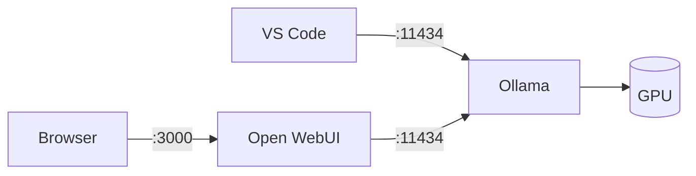
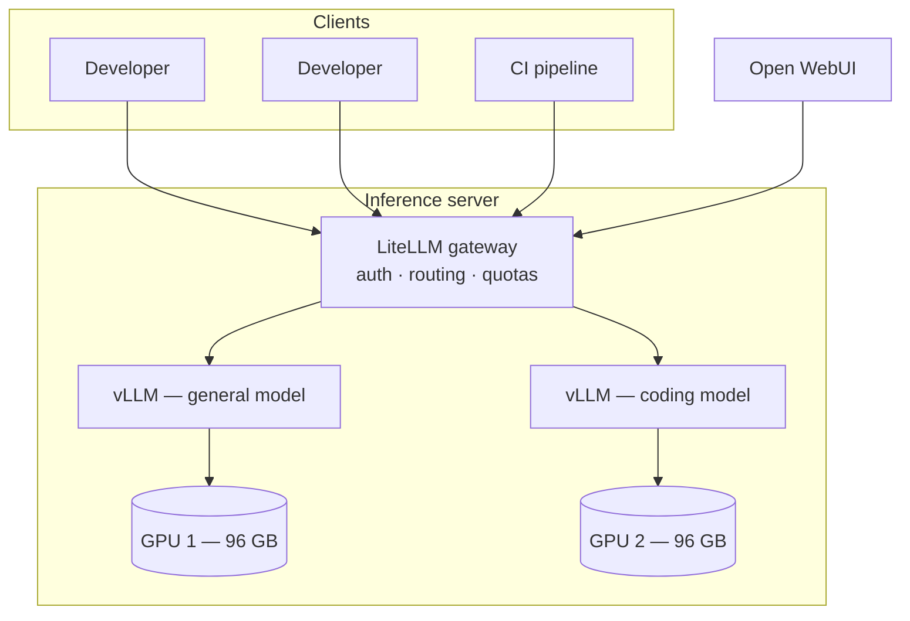
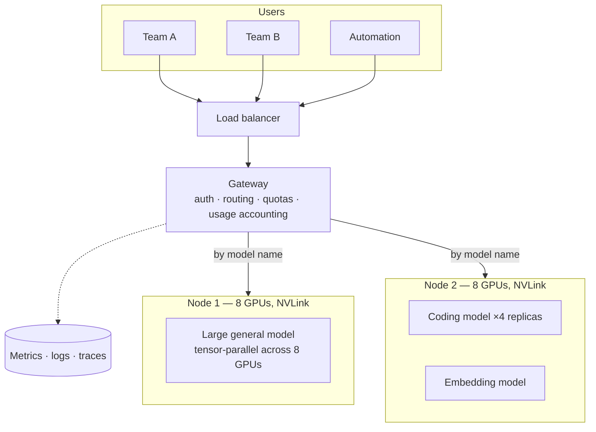
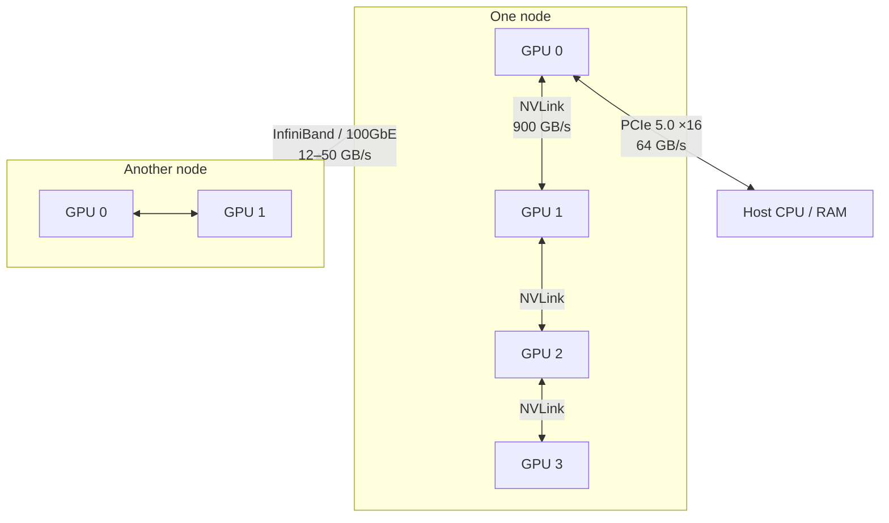

# 11. Reference architectures

Three concrete builds: one person, one team, several teams. Each with the hardware, the
wiring, the cost, and the models it can actually run.

## The hardware reference

Everything in this chapter draws on this table. Bandwidth is included because it
determines generation speed, and compute because it determines prompt processing speed
— the two are independent, and hardware is routinely good at one and poor at the other.

| Device | Memory | Bandwidth | FP16 compute | Price (EUR) |
| --- | --- | --- | --- | --- |
| RTX A2000 Mobile | 4 GB GDDR6 | ~190 GB/s | ~40 TFLOPS | in-laptop |
| RTX 4090 | 24 GB GDDR6X | ~1,010 GB/s | ~165 TFLOPS | ~2,000 |
| RTX 5090 | 32 GB GDDR7 | ~1,790 GB/s | ~210 TFLOPS | 2,500–3,000 |
| RTX PRO 6000 Blackwell | 96 GB GDDR7 | ~1,790 GB/s | ~250 TFLOPS | 8,000–10,000 |
| DGX Spark (GB10) | 128 GB unified | ~273 GB/s | ~125 TFLOPS | ~4,000 |
| Mac Studio, M-series Ultra | 96–512 GB unified | ~820 GB/s | ~55 TFLOPS | 5,000–12,000 |
| H100 SXM | 80 GB HBM3 | ~3,350 GB/s | ~990 TFLOPS | 25,000–30,000 |
| H200 SXM | 141 GB HBM3e | ~4,800 GB/s | ~990 TFLOPS | 30,000–40,000 |

Figures are approximate, vary by SKU, and move. Compute is dense FP16/BF16 — vendor
sheets often quote double these numbers "with sparsity", which does not apply to
ordinary inference. Read the ratios rather than the absolute values.

### Why unified memory has weak prefill

The Mac Studio row is the one that surprises people: enormous memory, respectable
bandwidth, and compute roughly one eighteenth of an H100. That last column is the
entire explanation for a behaviour that otherwise looks like a bug.

Prefill ([Chapter 4](/book/04-the-gpu)) processes every prompt token in parallel, so its
cost is arithmetic:

$$\text{prefill FLOPs} \approx 2 \times \text{active parameters} \times \text{prompt tokens}$$

Take a 70B dense model and a 32,000-token prompt — a medium-sized codebase, or a long
document:

$$2 \times 70 \times 10^9 \times 32 \times 10^3 = 4.5 \times 10^{15}\ \text{FLOPs}$$

| Hardware | Compute | Theoretical | Realistic (~35% efficiency) |
| --- | --- | --- | --- |
| H100 | ~990 TFLOPS | 4.5 s | ~13 s |
| RTX PRO 6000 | ~250 TFLOPS | 18 s | ~50 s |
| Mac Studio Ultra | ~55 TFLOPS | 82 s | **~4 minutes** |

All three then *generate* at broadly comparable rates, because generation is bound by
bandwidth and the bandwidth gap is far smaller than the compute gap.

So a unified-memory machine feels quick in conversation and unbearable the moment you
paste in something large. If your workload is chat, this barely matters. If it is
document analysis, code review, or any agent that re-reads a large context on every
step, it is disqualifying.

## Architecture A — one person

Everything on one machine, as built in [Chapter 6](/book/06-the-first-run).

| | Entry | Serious |
| --- | --- | --- |
| Hardware | Existing laptop, 4 GB VRAM | Workstation with one RTX 5090 |
| Cost | 0 | 3,500–4,500 incl. the rest of the machine |
| Stack | Ollama + Open WebUI | Same |
| Models | 4B fast, 30B sparse slowly | Up to 32B dense at 30–60 tok/s |
| Good for | Learning, light assistance | Real daily use, agentic coding on one repository |

The jump from the first column to the second is the best value in this entire chapter.
A single consumer card moves you from "interesting toy" to "genuinely useful" for
roughly the price of a laptop.

**Do not scale this by adding people.** Ollama serialises requests
([Chapter 10](/book/10-from-one-user-to-many)); the second concurrent user halves
everyone's speed.

## Architecture B — one team

Five to fifteen developers sharing one server.

**Hardware.** One server with two RTX PRO 6000 Blackwell cards: 192 GB of VRAM total,
~1,790 GB/s each, in a standard workstation chassis with ordinary power and cooling.

| Item | Cost (EUR) |
| --- | --- |
| 2× RTX PRO 6000 Blackwell | 16,000–20,000 |
| Server chassis, CPU, 256 GB RAM, NVMe | 5,000–7,000 |
| **Capital total** | **21,000–27,000** |
| Power, ~1.2 kW continuous at €0.25/kWh | ~220/month |
| Amortised over 3 years | ~700/month |
| **Running total** | **~900/month** |

**What it runs.** Each card independently holds a model up to ~120B sparse at Q4. A
typical split: a general model on one card, a coding model on the other.

| Card | Model | Concurrent users |
| --- | --- | --- |
| GPU 1 | `gpt-oss:120b` or `qwen3.5:122b` | 10–20 comfortably |
| GPU 2 | `qwen3-coder` or `devstral` | 10–20 comfortably |

The two cards are deliberately **not** joined to run one larger model. Two independent
models serving separate workloads is more useful to a team than one bigger model, and
it removes the interconnect from the design entirely.

**What is now required that was not before:** monitoring (the four metrics from
[Chapter 10](/book/10-from-one-user-to-many)), a gateway for authentication and quotas,
and someone whose job includes keeping it running.

## Architecture C — several teams

Fifty or more users, multiple models, uptime expectations.

**Hardware.** One or more 8-GPU nodes. An 8× H100 node provides 640 GB of VRAM joined
by NVLink; an 8× H200 node provides 1,128 GB.

| Item | Cost (EUR) |
| --- | --- |
| 8× H100 SXM node, complete | 200,000–300,000 |
| Power, ~10 kW continuous | ~1,800/month |
| Cooling, rack, network | substantial; site-dependent |
| Amortised over 3 years | ~7,000/month |

At this point renting deserves serious consideration. Cloud GPU instances cost roughly
€2–4 per H100-hour; an 8-GPU node used eight hours a day works out near €4,000–6,000
per month with none of the capital risk and no hardware that depreciates.

**What it runs.** Everything, including the largest open-weight models
([Chapter 8](/book/08-the-model-landscape)): DeepSeek-V3 at 671B, tensor-parallel across
eight GPUs, at production speed.

**What is now required:** orchestration, model versioning, per-team quotas, usage
accounting, on-call rotation. The infrastructure around the model exceeds the model in
both complexity and cost.

## How GPUs actually connect

The architectures above depend on how GPUs are wired, and the differences span orders
of magnitude.

| Link | Bandwidth | Where |
| --- | --- | --- |
| NVLink | up to ~900 GB/s | Between GPUs inside one chassis |
| PCIe 5.0 ×16 | ~64 GB/s | GPU to host, and between GPUs without NVLink |
| InfiniBand NDR | ~50 GB/s | Between nodes in a cluster |
| 100 GbE | ~12 GB/s | Between nodes, commodity |
| 10 GbE | ~1.2 GB/s | Ordinary office network |

Compare the top of that table with the bottom: NVLink is roughly 750 times faster than
an ordinary office network. That ratio is why "connect several PCs" is not a strategy.

## Splitting a model across GPUs

Three ways, and they are not interchangeable.

| Strategy | What it does | Interconnect required | Use for |
| --- | --- | --- | --- |
| **Tensor parallel** | Each layer is split across GPUs; they exchange data at every layer | NVLink. Very heavy traffic. | One model too large for one GPU, within a node |
| **Pipeline parallel** | Different layers on different GPUs; activations pass along the chain | Tolerates slower links | Spanning nodes when unavoidable |
| **Data parallel** | Full copy on each GPU; requests distributed between them | None — they never talk | **Throughput.** The usual answer. |

::: tip The rule
Tensor parallelism inside a node, data parallelism between nodes.

Pipeline parallelism across a slow network is a last resort, chosen only when a model
genuinely cannot fit any other way.
:::

A concrete illustration of the trap: splitting a model across two machines joined by
10 GbE means intermediate results cross a 1.2 GB/s link on every token. The GPUs idle
while the network works. The result is routinely slower than running a smaller model on
one machine.

::: warning Scale up before you scale out
One box with one large GPU beats several boxes with small ones — for capability, for
speed, and for the amount of your life spent on it.

Add machines to serve *more users*, never to make *one model* faster.
:::

## Local against API

The decision is not primarily financial, but the arithmetic is worth doing.

A single heavy user of a hosted service might spend €100–200 per month. Architecture B
costs about €900 per month all-in, so it breaks even somewhere around five to nine
heavy users — at which point it also offers unlimited volume, fixed costs, and data
that never leaves the building.

But the comparison is not like for like:

| Local wins on | API wins on |
| --- | --- |
| Data that cannot leave the premises | Capability per euro at low volume |
| Regulatory and contractual constraints | Zero operational burden |
| Air-gapped environments | Bursty, unpredictable demand |
| High, steady volume | Access to frontier models |
| Fixed, predictable cost | No capital commitment, no depreciation |

Most organisations end up running both: local for sensitive and routine work, hosted
for the genuinely hard problems. That is a sound outcome, not a failure to commit.

## The cost people forget

A GPU server is a server. It needs power, cooling, driver and model updates,
monitoring, backups, security patching, and a person who is responsible for it.

That operational cost is regularly larger than the hardware and is almost always left
out of the comparison. Include it before the meeting, not after.
