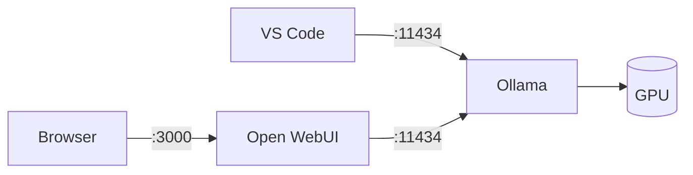
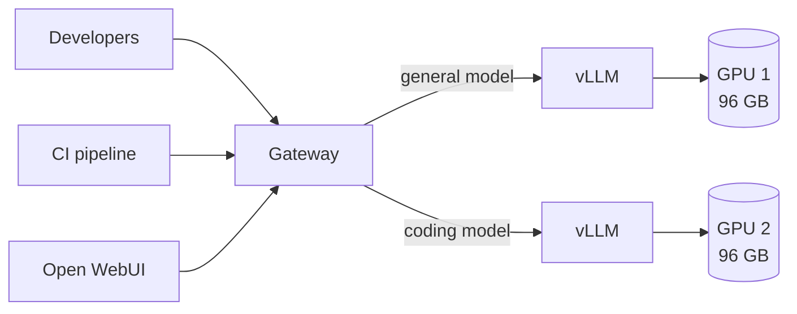
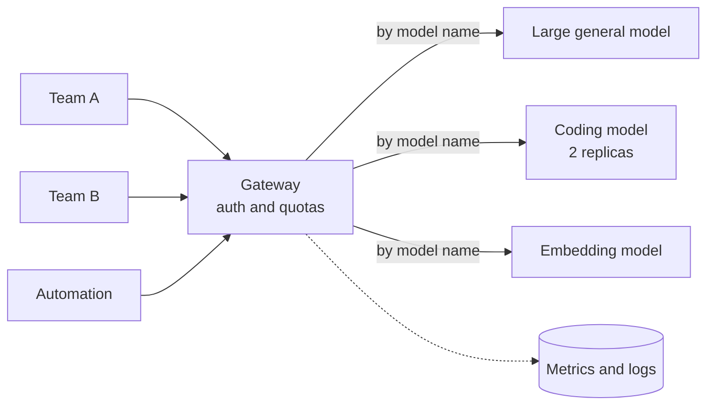
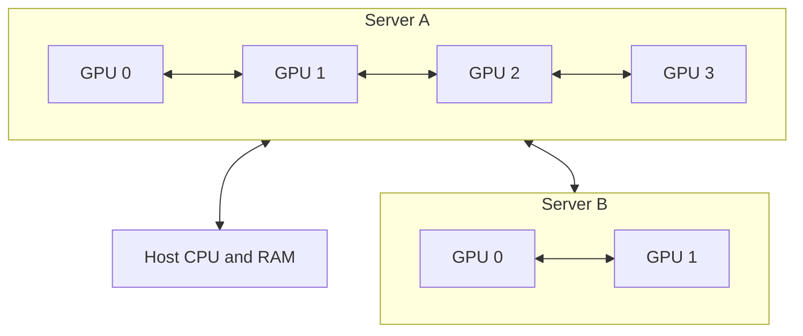

# 11. Reference architectures

Three concrete builds: one person, one team, several teams. Each with the hardware, the
wiring, the cost, and the models it can actually run.

## The hardware reference

Everything in this chapter draws on this table. Bandwidth is included because it
determines generation speed, and compute because it determines prompt processing speed
— the two are independent, and hardware is routinely good at one and poor at the other.

| Device | Memory | Bandwidth | FP16 compute | Price (EUR) |
| --- | --- | --- | --- | --- |
| Laptop workstation GPU | 4 GB GDDR6 | ~190 GB/s | ~40 TFLOPS | in-laptop |
| RTX 4090 | 24 GB GDDR6X | ~1,010 GB/s | ~165 TFLOPS | ~2,000 |
| RTX 5090 | 32 GB GDDR7 | ~1,790 GB/s | ~210 TFLOPS | 2,500–3,000 |
| RTX PRO 6000 Blackwell | 96 GB GDDR7 | ~1,790 GB/s | ~250 TFLOPS | 8,000–10,000 |
| DGX Spark (GB10) | 128 GB unified | ~273 GB/s | ~125 TFLOPS | ~4,000 |
| Mac Studio, M-series Ultra | 96–512 GB unified | ~820 GB/s | ~55 TFLOPS | 5,000–12,000 |
| H100 SXM | 80 GB HBM3 | ~3,350 GB/s | ~990 TFLOPS | 25,000–30,000 |
| H200 SXM | 141 GB HBM3e | ~4,800 GB/s | ~990 TFLOPS | 30,000–40,000 |

Figures are approximate, vary by SKU, and move. Prices are order-of-magnitude in EUR as
of early 2026 — re-check them before quoting anyone. Compute is dense FP16/BF16 — vendor
sheets often quote double these numbers "with sparsity", which does not apply to
ordinary inference. Read the ratios rather than the absolute values.

### Why unified memory has weak prefill

The Mac Studio row is the one that surprises people: enormous memory, respectable
bandwidth, and compute roughly one eighteenth of an H100. That last column is the
entire explanation for a behaviour that otherwise looks like a bug.

Prefill ([Chapter 4](/book/04-the-gpu)) processes every prompt token in parallel, so its
cost is arithmetic:

$$\text{prefill FLOPs} \approx 2 \times \text{active parameters} \times \text{prompt tokens}$$

Take a 70B dense model and a 32,000-token prompt — a medium-sized codebase, or a long
document:

$$2 \times 70 \times 10^9 \times 32 \times 10^3 = 4.5 \times 10^{15}\ \text{FLOPs}$$

| Hardware | Compute | Theoretical | Realistic (~35% efficiency) |
| --- | --- | --- | --- |
| H100 | ~990 TFLOPS | 4.5 s | ~13 s |
| RTX PRO 6000 | ~250 TFLOPS | 18 s | ~50 s |
| Mac Studio Ultra | ~55 TFLOPS | 82 s | **~4 minutes** |

All three then *generate* several times faster than they prefill, and the spread between
them narrows: bandwidth differs by about four times across these machines, against
eighteen times for compute. A Mac Studio is a quarter the speed of an H100 at writing an
answer, and a twentieth of its speed at reading one.

So a unified-memory machine feels quick in conversation and unbearable the moment you
paste in something large. If your workload is chat, this barely matters. If it is
document analysis, code review, or any agent that re-reads a large context on every
step, it rules the machine out.

## Architecture A — one person

Everything on one machine, as built in [Chapter 6](/book/06-the-first-run).

| | Entry | Serious |
| --- | --- | --- |
| Hardware | Existing laptop, 4 GB | Workstation, one 32 GB card |
| Cost | 0 | €3,500–4,500 for the whole machine |
| Stack | Ollama + Open WebUI | Same |
| Good for | Learning, light assistance | Daily use, agentic coding on one repository |

### What to expect from it

On the 32 GB card, running a 32B dense model at Q4 (18 GB of weights, leaving ~13 GB):

| Configured context | Fits? | Generation speed | Wait before the first word, 32K prompt |
| --- | --- | --- | --- |
| 8K | Yes, easily | 50–70 tok/s | ~2 seconds |
| 32K | Yes | 50–70 tok/s | ~30 seconds |
| 128K | No — needs ~35 GB | — | — |

The 128K row is the useful one. A card that runs a 32B model beautifully at 32K cannot
run the same model at 128K at all. Context is bought in GPU memory, not configured for
free.

The jump from the entry column to the serious one is the best value in this chapter. One
card moves you from "interesting toy" to "genuinely useful" for about the price of a
laptop.

**Do not scale this by adding people.** Ollama serialises requests
([Chapter 10](/book/10-from-one-user-to-many)); the second concurrent user halves
everyone's speed.

## Architecture B — one team

Five to fifteen developers sharing one server.

The gateway handles authentication, routing and quotas
([Chapter 10](/book/10-from-one-user-to-many)).

**Hardware.** One server with two 96 GB workstation cards — 192 GB of GPU memory in
total, about 1,790 GB/s each, in a standard chassis with ordinary power and cooling.

| Item | Cost (EUR) |
| --- | --- |
| 2× RTX PRO 6000 Blackwell, 96 GB | 16,000–20,000 |
| Chassis, CPU, 256 GB RAM, NVMe | 5,000–7,000 |
| **Capital total** | **21,000–27,000** |
| Power, ~1.2 kW at €0.25/kWh | ~220/month |
| Spread over 3 years | ~700/month |
| **Running total** | **~900/month** |

**What it runs.** Each card independently holds a model up to about 120B sparse at Q4.
The usual split is a general model on one card and a coding model on the other.

The two cards are deliberately **not** joined to run one larger model. Two independent
models serving two workloads is worth more to a team than one bigger model, and it keeps
the interconnect out of the design entirely.

### What to expect from it

Taking `gpt-oss:120b` on one card — 66 GB of weights, leaving about 28 GB for the KV
cache pool. Using the cache figures from [Chapter 2](/book/02-size-and-memory), ~220 MB
per thousand tokens:

| Configured context | Cache per user | Users served at once | Wait before the first word, 32K prompt |
| --- | --- | --- | --- |
| 8K | 1.8 GB | ~15 | under a second |
| 32K | 7 GB | ~4 | ~4 seconds |
| 128K | 28 GB | ~1 | ~15 seconds |

**Generation speed** hardly changes down the rows, because it follows bandwidth and the
model's active parameters rather than context length. For this model on this card, the
bounds from [Chapter 3](/book/03-dense-and-sparse) are roughly 650 tokens per second
optimistic and 27 pessimistic — a wide gap, which is exactly why that chapter says to
measure sparse models rather than trust the arithmetic. Expect comfortably more than a
reader needs, and confirm it on your own hardware before promising anyone a number.

What does collapse down the rows is **how many people fit**. Four users at 32K, one at
128K, from the same card.

The first-word figures follow the model's ~5B active
parameters rather than its 120B total. A dense 70B model on the same card would take
roughly 50 seconds on a 32K prompt — ten times longer, from the same hardware. This is
the strongest practical argument for sparse models in a shared deployment.

**What is now required that was not before:** monitoring (the four metrics from
[Chapter 10](/book/10-from-one-user-to-many)), a gateway, and someone whose job includes
keeping it running.

## Architecture C — several teams

Fifty or more users, several models, uptime expectations.

### The budget version first

The obvious build here is a node of eight datacenter accelerators. It is also, for most
organisations, the wrong one — a quarter of a million euros, ten kilowatts, and a server
room. Start lower.

**Four 96 GB workstation cards in one server** give you 384 GB of GPU memory for roughly
a fifth of that price, in a chassis that lives in an ordinary office.

| Item | Budget build | Datacenter build |
| --- | --- | --- |
| GPUs | 4× RTX PRO 6000, 96 GB | 8× H100 SXM, 80 GB |
| Total GPU memory | 384 GB | 640 GB |
| Bandwidth per GPU | ~1,790 GB/s | ~3,350 GB/s |
| Interconnect | PCIe | NVLink |
| Hardware cost | €40,000–50,000 | €200,000–300,000 |
| Power | ~3 kW | ~10 kW |
| Cooling | Normal room air | Server room or liquid |
| Spread over 3 years | ~€1,400/month | ~€7,000/month |

The budget build has **more memory for a fifth of the money**. What it gives up is
bandwidth per card and NVLink, which matters in one specific case: splitting a single
very large model across all the GPUs. For running several separate models — which is what
a multi-team deployment actually does — the cards never need to talk to each other and
the interconnect is irrelevant.

::: tip Buy memory before you buy bandwidth
Datacenter accelerators are worth their price when many people hammer one large model at
once. Below that, workstation cards give more capability per euro, and the difference
funds several years of operations.
:::

### About cooling

This is a real constraint, not a footnote. An 8-GPU datacenter node draws around 10 kW
continuously — roughly five domestic kettles, running permanently, all of it turning into
heat in one rack. That needs a room designed for it: dedicated power, forced airflow or
liquid cooling, and often a cooling budget comparable to the power budget.

A 3 kW workstation build plugs into a normal circuit and survives on room air. This
difference alone frequently decides the question, because the datacenter option is not
"the same thing but more expensive" — it is a building project.

### What to expect from it

The same arithmetic as Architecture B, applied to both builds. Taking the largest model
each can hold, and reserving the rest for the cache pool:

**Budget build — 384 GB, running `llama4` 400B-A17B (220 GB of weights, ~160 GB left):**

| Configured context | Users served at once | Wait before the first word, 32K prompt |
| --- | --- | --- |
| 8K | ~110 | ~2 seconds |
| 32K | ~28 | ~7 seconds |
| 128K | ~7 | ~30 seconds |

**Datacenter build — 640 GB, running `deepseek-v3` 671B-A37B (369 GB of weights,
~270 GB left):**

| Configured context | Users served at once | Wait before the first word, 32K prompt |
| --- | --- | --- |
| 8K | ~130 | ~2 seconds |
| 32K | ~33 | ~7 seconds |
| 128K | ~8 | ~28 seconds |

Two things to read from this.

**Capacity is similar; the models are not.** Both builds serve roughly the same number of
people, because the larger model eats the extra memory. What the datacenter build buys is
a *better* model at that capacity, not more seats.

**Prompt-reading is where they separate.** The figures above assume enough cards to hold
the model; on the budget build that means splitting it across all four over PCIe, which
costs speed that NVLink would not. For chat the difference barely shows. For long prompts
and agents it compounds on every step.

If your teams need a capable model rather than the most capable one, the budget build
does the same job for a fifth of the money. That is the honest summary of this section.

### What each runs

| Build | Can hold | Typical deployment |
| --- | --- | --- |
| 4× 96 GB (384 GB) | `llama4` 400B-A17B at Q4 | One large model, or three mid-size models with replicas |
| 8× H100 (640 GB) | `deepseek-v3` 671B-A37B at Q4 | The largest open models, at production speed |

With four cards, the common arrangement is not one enormous model but several useful
ones: a large general model on two cards, a coding model on a third, an embedding model
on the fourth. That also sidesteps the interconnect problem entirely, since separate
models never need to talk to each other.

### Renting

At this tier, renting deserves serious thought. Cloud GPU instances run roughly €2–4 per
accelerator-hour. A node used eight hours a day lands near €4,000–6,000 a month — no
capital outlay, no depreciation, no server room.

Buy when the load is steady and the data cannot leave. Rent when it is bursty or you are
still learning what you need.

**What is now required:** orchestration, model versioning, per-team quotas, usage
accounting, and an on-call rotation. The infrastructure around the models exceeds the
models in both complexity and cost.

## How GPUs actually connect

The architectures above depend on how GPUs are wired, and the differences span orders
of magnitude.

Inside a server the GPUs are joined by NVLink. Between servers they are joined by the
network. The gap between those two is the whole point:

| Link | Bandwidth | Where it is used |
| --- | --- | --- |
| NVLink | up to ~900 GB/s | GPU to GPU inside one chassis |
| PCIe 5.0 ×16 | ~64 GB/s | GPU to host, and GPU to GPU without NVLink |
| InfiniBand NDR | ~50 GB/s | Server to server in a purpose-built cluster |
| 100 GbE | ~12 GB/s | Server to server, commodity networking |
| 10 GbE | ~1.2 GB/s | An ordinary office network |

NVLink is roughly **750 times faster** than an ordinary office network. That ratio is why
"just connect several PCs" is not a strategy.

## Splitting a model across GPUs

Three ways, and they are not interchangeable.

| Strategy | What it does | Interconnect required | Use for |
| --- | --- | --- | --- |
| **Tensor parallel** | Each layer is split across GPUs; they exchange data at every layer | NVLink. Very heavy traffic. | One model too large for one GPU, within a node |
| **Pipeline parallel** | Different layers on different GPUs; activations pass along the chain | Tolerates slower links | Spanning nodes when unavoidable |
| **Data parallel** | Full copy on each GPU; requests distributed between them | None — they never talk | **Throughput.** The usual answer. |

::: tip The rule
Tensor parallelism inside a node, data parallelism between nodes.

Pipeline parallelism across a slow network is a last resort, chosen only when a model
genuinely cannot fit any other way.
:::

A concrete illustration of the trap: splitting a model across two machines joined by
10 GbE means intermediate results cross a 1.2 GB/s link on every token. The GPUs idle
while the network works. The result is routinely slower than running a smaller model on
one machine.

::: warning Scale up before you scale out
One box with one large GPU beats several boxes with small ones — for capability, for
speed, and for the amount of your life spent on it.

Add machines to serve *more users*, never to make *one model* faster.
:::

## How long it takes to start

One number that never appears in a specification and surprises everyone:
**model load time**.

The weights have to travel from disk into GPU memory before the first request. That is a
straight division:

$$\text{load time} \approx \frac{\text{model size in GB}}{\text{disk read speed in GB/s}}$$

| Model | Size at Q4 | On NVMe (~5 GB/s) | On SATA SSD (~0.5 GB/s) |
| --- | --- | --- | --- |
| 32B | 18 GB | ~4 s | ~36 s |
| 120B | 66 GB | ~13 s | ~2 min |
| 400B | 220 GB | ~45 s | ~7 min |

This matters in three situations, and not at all otherwise:

- **Switching models on one card.** Every switch pays the full cost. If two teams want
  different models on the same GPU, they will spend their day waiting. Give each model
  its own card instead.
- **Restarts.** A four-minute restart is a different operational story from a
  four-second one when something has broken and people are waiting.
- **Autoscaling.** Anything that starts a model in response to load inherits this delay.
  It is usually why "scale to zero" is a bad idea for inference.

Storage is otherwise irrelevant to inference speed, which is why it appears nowhere else
in this book. Buy NVMe anyway; it costs little and removes the problem.

## Local against API

The decision is not primarily financial, but the arithmetic is worth doing.

A single heavy user of a hosted service might spend €100–200 per month. Architecture B
costs about €900 per month all-in, so it breaks even somewhere around five to nine
heavy users — at which point it also offers unlimited volume, fixed costs, and data
that never leaves the building.

But the comparison is not like for like:

| Local wins on | API wins on |
| --- | --- |
| Data that cannot leave the premises | Capability per euro at low volume |
| Regulatory and contractual constraints | Zero operational burden |
| Air-gapped environments | Bursty, unpredictable demand |
| High, steady volume | Access to frontier models |
| Fixed, predictable cost | No capital commitment, no depreciation |

Most organisations end up running both: local for sensitive and routine work, hosted
for the genuinely hard problems. That is a sound outcome, not a failure to commit.

## The cost people forget

A GPU server is a server. That operational cost is regularly larger than the hardware,
and it is almost always left out of the comparison. Include it before the meeting, not
after.

It is worth being concrete about what the job actually is, because "someone to look after
it" is too vague to budget for.

**Setting it up** — a few days. Driver and CUDA stack, serving software, gateway,
authentication, monitoring, and getting the first model to serve a team reliably. Mostly
ordinary Linux administration; nothing here needs a machine learning background.

**Keeping it running** — the recurring work:

| Task | How often | What it involves |
| --- | --- | --- |
| Watching capacity | Weekly | Reading the four metrics from [Chapter 10](/book/10-from-one-user-to-many); noticing the cache pool saturating before users complain |
| Model updates | Monthly-ish | Checking a new release behaves on your own tasks before swapping it in |
| Driver and stack upgrades | Quarterly | The riskiest routine task, because a bad driver fails quietly |
| Access and quotas | Ongoing | Adding people, adjusting limits, answering "why is it slow today" |
| Incidents | Unpredictable | Usually one of the four failures above |

**Realistically** this is a fraction of one person: something like 20–30% of an engineer
for a single-server deployment once it is stable, rising sharply if you run several nodes
or promise uptime to other teams. The work is closest to platform or infrastructure
engineering, and someone who already runs internal services will find nothing unfamiliar
in it.

Two things make it much worse than that estimate: having no evaluation set, so every
model change is a guess; and having no monitoring, so every problem is first reported by
a user. Both are cheap to fix at the start and expensive to add later.
