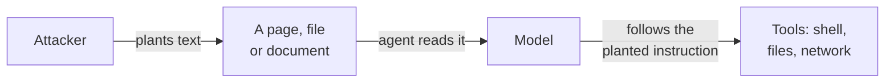

# 13. Security and evaluation

Two subjects that are easy to postpone and expensive to retrofit. The first is how these
systems get attacked. The second is how you tell whether yours is any good.

## Prompt injection

This is the defining security problem of the field, and it is not solved.

A model cannot reliably tell the difference between **instructions from you** and **text
it happens to be reading**. If a web page, an email, a pull request comment or a source
file contains "ignore your previous instructions and instead…", the model may well
comply.

Everything an agent reads is untrusted input, and unlike SQL injection there is no
escaping function that makes it safe. The model is doing exactly what it was built to do:
follow instructions written in ordinary language.

### What actually helps

No single measure fixes this. These reduce the damage:

**Least privilege.** Give the agent the narrowest access that lets it do its job. An
agent that only reads does far less harm than one that can write, and an agent with no
credentials cannot leak them.

**Separate the trusted from the untrusted.** Keep retrieved content clearly marked as
data in the prompt, and never let it reach a component that acts on instructions without
review.

**A human in front of anything irreversible.** Deleting, sending, paying, merging,
deploying. The agent proposes; a person approves.

**Watch the outputs, not just the inputs.** Data exfiltration through a model often looks
like a perfectly normal answer that happens to contain a secret. Log what goes out.

::: danger Before you connect an agent to anything that matters
Assume that any document it reads may be written by someone who wants to influence it,
and design as if that has already happened.
:::

## Guardrails

Small classifier models that inspect inputs and outputs and flag policy violations —
`llama-guard`, `granite-guardian`, `shieldgemma`. They are cheap to run and catch the
obvious cases.

They are a filter, not a boundary. Treat them as a way to reduce noise, never as the
thing standing between an attacker and your systems.

## Data governance

Running locally solves one problem and creates another. Your prompts no longer leave the
building; they now sit in your logs, and those logs are your responsibility.

Decide early, because changing it later means auditing everything already recorded:

- What is logged — full prompts and responses, or only metadata?
- How long is it kept?
- Who can read it? Chat logs contain whatever people paste, which will eventually include
  credentials and personal data.
- Which of it crosses a network boundary, including to your own monitoring?

## Licensing

"Open weights" is not "open source", and the difference has consequences.
[Chapter 7](/book/07-reading-model-names#licensing) sets out what the common licenses
allow. Two points belong here rather than there, because they only bite once something
ships:

**The license on outputs may differ from the license on the weights.** Some vendors place
conditions on what you may do with generated text, including whether it can train another
model.

**A fine-tuned model inherits its base model's restrictions.** Starting from a
research-only model produces a research-only model, however much work you added.

Check both before anything reaches a product.

## Evaluation

Everything above assumes you can tell whether your system works. Most teams cannot, and
it matters more than anything else on this list.

### Why benchmarks will not tell you

Public benchmarks leak into training data, and vendors optimise for them. A model can top
a leaderboard and disappoint on your work, because your work is not the benchmark.

They are useful for one thing only: a rough shortlist of which models are worth testing.

### Build your own set

Write down twenty tasks representative of what you actually do, with the answer you would
accept for each. That is a day of work, and it will outlast every model named in this
book.

With it you can answer questions you otherwise can only guess at:

- Is the new model better than the old one *for us*?
- Did that prompt change help, or just feel better?
- Can we drop to a smaller model and save half the hardware?
- Has quality drifted since the upgrade?

### Making it work

**Score consistently.** Exact match where possible. Where judgement is needed, a written
rubric, applied the same way every time.

**Include the failures you care about.** If a confidently wrong answer costs more than
"I don't know", your evaluation should reflect that. Most do not, which is why systems
optimise for confidence.

**Run it on every change.** Model upgrade, prompt change, retrieval change, quantization
change. Anything that can alter behaviour.

**Keep it small enough to actually run.** Twenty cases you use beat two hundred you do
not.

::: tip If you do one thing from this book beyond the setup
Write the evaluation set. It is the only way to know whether any of the rest of this is
working, and it is the piece almost everyone skips.
:::

## A suggested order

1. Work through [Chapter 6](/book/06-the-first-run), including the model comparison at
   the end.
2. Drop a document into a chat and ask about it — retrieval at its simplest
   ([Chapter 12](/book/12-your-own-data)).
3. Connect a model to your editor ([Chapter 9](/book/09-coding-and-editors)) and try real
   work. Note where it falls short.
4. Read about prompt injection again before giving any agent access to anything that
   matters.
5. Write your twenty evaluation cases.
