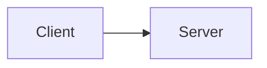

# Contributing

This book is meant to be extended by the people who use it. The bar is low: if you
learned something the hard way, it belongs here.

## Running it locally

```bash
npm install
npm run docs:dev      # http://localhost:5173
```

Build exactly as CI does before opening a pull request:

```bash
npm run docs:build
```

A push to `main` deploys automatically via GitHub Actions.

## Adding a chapter

1. Create `book/NN-<slug>.md`, where `NN` is the two-digit chapter number. The prefix
   sets the reading order and appears in the URL, so keep the numbering contiguous.
2. Add it to the `sidebar` array in [`.vitepress/config.mts`](https://github.com/kamil-kielbasa/ai-infrastructure/blob/main/.vitepress/config.mts).
3. Start the file with a single `#` heading matching the sidebar entry.

Inserting a chapter in the middle means renumbering the ones after it, and updating
every cross-reference that points at them. Prefer appending to a part, or splitting an
existing chapter, over inserting.

## How the book was written

The first draft was generated by a large language model, then reviewed and corrected by
a human. This is disclosed on the front page and in the README, and should stay
disclosed.

If you extend the book the same way, that is fine — but verify every number and every
product claim against primary sources before committing. The failure mode of
AI-generated technical writing is confident, well-formatted, plausible detail that is
simply wrong.

## House style

The book has a voice. Keeping it consistent matters more than any individual
sentence being perfect.

**Explain before you use.** No term appears without a definition preceding it. If a
chapter needs a concept from elsewhere, link to it rather than re-explaining.

**Short words, short sentences.** Prefer the plain word. Cut any sentence that only
restates the previous one.

**Numbers over adjectives.** Not "a lot of memory bandwidth" but "1,790 GB/s". If a
figure is approximate or disputed, say so inline — `~`, "roughly", "reported but never
confirmed". Never launder an estimate into a fact.

**State the limits.** Where local hardware loses to a hosted service, say it plainly.
The book's usefulness depends on the reader trusting that it is not selling anything.

**Tables for comparisons, prose for reasoning.** If a paragraph is really a list of
attributes, make it a table.

## Diagrams

Use Mermaid in fenced blocks; the plugin renders them at build time.

````markdown

````

Diagrams should carry information the prose cannot. A diagram that restates a sentence
is noise. Good candidates: how components connect, where data physically moves, how a
request is routed.

## Perishable content

Model names, prices and product SKUs date quickly. Two rules keep maintenance cheap:

- Put the durable reasoning in the prose and the perishable specifics in tables. A
  table row is easy to update; a rewritten argument is not.
- Prices are order-of-magnitude in EUR, and labelled as such. Do not add precision the
  figure does not have.

## Reviewing

One approving review is enough. Reviewers should check the claim, not the prose style
— a wrong number matters, an unusual comma does not.
